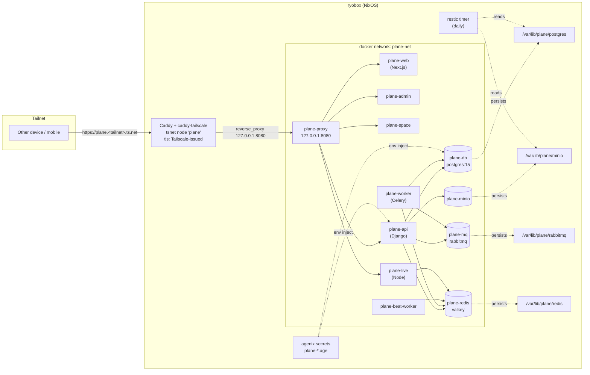

# feat: Plane (Linear代替, Tailnet限定) を ryobox に導入

## Overview

個人の issue tracker として Plane (AGPL, OSS) を ryobox にセルフホストする。ingress は Forgejo plan が採用した caddy-tailscale plugin 経路に揃え、Caddy 内に独立 tailnet node `plane` を立てて `plane.<tailnet>.ts.net` で TLS 終端する (Cloudflare DNS-01 は使わない)。Linear personal workspace (無料枠 issue 上限超過) から全移行し、Linear MCP (`linear-personal`) を公式 `plane-mcp-server` に置換する。work 側 (`linear-work`) は現状維持。

## Problem Frame

- Linear 無料枠の issue 数上限を超過、新規 issue 起票が制限される
- 既存インフラ (Caddy + agenix + Tailscale SSH + `virtualisation.docker.enable = true`) + 先行 Forgejo plan で確定した caddy-tailscale 経路に乗せて、Docker Compose ベースの Plane を宣言的に抱えられる
- 個人 1 user + 数 project 規模なので Plane Community Edition (AGPL v3) の機能で十分
- 公式 Linear importer が存在し、issues / cycles / labels / comments / attachments を差分再実行可能な形で移行できる
- 公式 `makeplane/plane-mcp-server` (Python + FastMCP, 55+ tools) が stdio / Remote HTTP 両対応。セルフホスト側では stdio + `PLANE_BASE_URL` で self-hosted instance を指せる

## Requirements Trace

- R1. Plane が ryobox 上で常駐し、Tailnet 内の他端末/モバイルからブラウザ + HTTPS でアクセスできる
- R2. Community Edition を AGPL 準拠でセルフホスト (外部 managed 依存なし)
- R3. データ永続化は bind mount (`/var/lib/plane/<service>`) で NixOS 管理パスに露出。restic 等で直接バックアップ可能
- R4. Caddy が caddy-tailscale plugin 経由で独立 tailnet node `plane` を立て、Tailscale 発行証明書で `plane.<tailnet>.ts.net` を自動更新する (Cloudflare DNS 依存なし)
- R5. 既存 firewall (`tailscale0` のみ 80/443) を維持し、host 側の追加 port も外部 DNS record も作らない
- R6. agenix で暗号化された secret (Django `SECRET_KEY`, Postgres password, Plane API key) をコンテナに注入する
- R7. Linear personal workspace の issues / cycles / labels / comments / attachments を Plane workspace へ移行する
- R8. Claude Code MCP を `linear-personal` から `plane-personal` (stdio, 公式 plane-mcp-server) に置換し、CLAUDE.md の Linear MCP Routing 表を更新
- R9. Postgres + MinIO の日次 backup を取得 (外部転送は deferred)

## Scope Boundaries

- `linear-work` (仕事 workspace) の移行は行わない — 現状維持
- Plane Commercial Edition / Airgapped Edition は採用しない (CE で十分)
- 外部 (公開インターネット) からのアクセス経路は作らない
- SSO / OAuth / SMTP 通知設定は初期スコープ外
- Plane Actions / workflows 類似機能の活用は後続
- 他 host への展開 (multi-host) は考慮しない

### Deferred to Separate Tasks

- **backup の外部転送** (B2 / S3 / 別 host): 別 plan。現状は ryobox ローカル restic repo
- **Linear work 側の全移行**: 仕事 workspace の料金/制約次第で別 plan 化
- **Plane → Forgejo issue linkage**: Forgejo と issue 相互参照の仕組み化は別 plan
- **host PostgreSQL の共有化**: Forgejo plan が独立 Postgres を要求、Plane は container 内 Postgres で起動する。将来統合したくなったら別 plan

## Context & Research

### Relevant Code and Patterns

- `hosts/ryobox/default.nix:97-105` — Caddy `withPlugins` list。Forgejo plan Unit 3 で `github.com/tailscale/caddy-tailscale` が追加される予定 → Plane はその plugin を前提に vhost を追加するだけ
- `hosts/ryobox/default.nix:126-149` — agenix secrets パターン (`age.secrets.<name> = { file = ../../secrets/<name>.age; owner = ...; mode = "0400"; }`)
- `hosts/ryobox/default.nix:150-151` — `systemd.services.caddy.serviceConfig.EnvironmentFile` で secret をサービスに注入する既存例 (Forgejo plan で list 化予定、Plane はそこに追加)
- `hosts/ryobox/default.nix:51-54` — `firewall.interfaces.tailscale0.allowedTCPPorts = [80 443]`。caddy-tailscale は tsnet で独立接続するため、host の port 追加は不要
- `hosts/ryobox/default.nix:214` — `virtualisation.docker.enable = true` 既に ON、`oci-containers.backend = "docker"` が自然
- `secrets/secrets.nix` — `ryobox` ed25519 public key で暗号化する単一 host agenix recipient pattern
- `docs/plans/2026-04-18-001-feat-forgejo-tailnet-deployment-plan.md` (revised 2026-04-19) — 同じ土台 (caddy-tailscale + agenix + oci-containers 相当) の先行 plan。特に Unit 3 (caddy-tailscale plugin + `caddy-tailscale-authkey.age`) は Plane が依存する。構造とテスト観点を reuse
- `hosts/ryobox/default.nix:12-17` / `home/agents/default.nix` — `sharedMcpServers` の定義元。MCP の追加/削除はここで行う
- `CLAUDE.md` の Linear MCP Routing 表 (`~/.claude/CLAUDE.md`) — 置換対象

### Institutional Learnings

- CLAUDE.md `feedback_no_local_edit.md` — dotfiles 管理下ファイルはローカル直接編集禁止。Plane が書き換える `.env` 等は container 内 state に任せ、Nix module で宣言する値は `environment` 属性に寄せる
- CLAUDE.md `feedback_mcp_transport.md` — MCP は http transport 優先。ただし self-hosted Plane を指す場合は `PLANE_BASE_URL` が必要なため stdio (公式 plane-mcp-server 推奨) を採用。mcp-remote wrapper は不要 (ネイティブ stdio transport)
- CLAUDE.md `feedback_dotfiles_skills_placement.md` — 類似の配置原則で、本件も `hosts/ryobox/plane.nix` の独立 module とする

### External References

- [Plane docker-compose.yml (preview)](https://github.com/makeplane/plane/blob/preview/docker-compose.yml) — 公式サービス一覧 (web / admin / space / api / worker / beat-worker / live / proxy / plane-db / plane-redis / plane-mq / plane-minio)
- [Plane Docker Compose install docs](https://developers.plane.so/self-hosting/methods/docker-compose) — RAM 推奨 8GB / 最低 4GB、`LISTEN_HTTP_PORT` 等の env
- [Plane Editions and Versions](https://developers.plane.so/self-hosting/editions-and-versions) — CE = AGPL v3
- [Configure external services](https://developers.plane.so/self-hosting/govern/database-and-storage) — 本番では外部 Postgres + 外部 S3 互換推奨。本 plan はローカル bind mount で簡素化
- [Linear Importer | Plane](https://docs.plane.so/importers/linear) — 公式 importer、PAT 接続、差分再実行可
- [plane-mcp-server GitHub](https://github.com/makeplane/plane-mcp-server) — 公式、Python + FastMCP、stdio `uvx plane-mcp-server stdio` + env (`PLANE_API_KEY`, `PLANE_WORKSPACE_SLUG`, `PLANE_BASE_URL`)
- [Plane MCP server docs](https://developers.plane.so/dev-tools/mcp-server) — 55+ tools, 8 カテゴリ
- [caddy-tailscale plugin](https://github.com/tailscale/caddy-tailscale) — `bind tailscale/<node>` + `tls { get_certificate tailscale }`、named node で `<svc>.<tailnet>.ts.net` を複数払い出せる
- [Tailscale HTTPS (MagicDNS + cert)](https://tailscale.com/kb/1153/enabling-https) — admin console で HTTPS 機能 ON が前提
- [NixOS `virtualisation.oci-containers`](https://search.nixos.org/options?channel=unstable&query=virtualisation.oci-containers) — `backend`, `containers.<name>.{image, volumes, environment, environmentFiles, dependsOn, ports, extraOptions}`

## Key Technical Decisions

- **Module 分割**: `hosts/ryobox/plane.nix` を新設し `imports` 経由で取り込む。Forgejo plan と同じ分割ルール。`hosts/ryobox/default.nix` は 290 行、plane 関連 (containers / caddy vhost / agenix / backup timer) を混入すると見通し悪化
- **Orchestration**: `virtualisation.oci-containers` (backend = docker) で宣言。Docker Compose を直接使わず NixOS-native で container group を定義。`dependsOn` + `autoStart` で起動順と systemd unit 管理を得る
- **データ永続化方式**: bind mount (`/var/lib/plane/{postgres,minio,rabbitmq,redis}`)。named volume より: (a) Nix 宣言で owner/mode を固定 (`systemd.tmpfiles.rules`) (b) restic が通常パスを直接 scan (c) マシン移行時に rsync で済む (d) dotfiles 思想「パスも設定のうち」と整合
- **Postgres**: Plane 専用 container 内 postgres (official preview compose の `postgres:15.7-alpine`)。host postgres 共有は Forgejo plan との整合と upgrade 独立性を理由に見送り。将来 Forgejo plan 完了後に統合案を別 plan 化
- **Internal proxy container を残す**: Plane 公式の `proxy` container (内部 nginx) は保持し、host Caddy からはシングル upstream (`127.0.0.1:8080`) として扱う。個別 path (`/`, `/spaces`, `/god-mode`, `/api`, `/live`) の routing を host Caddy に再実装しない — Plane upgrade 時の routing 変更に追従しやすい
- **TLS / Domain**: **caddy-tailscale plugin + Tailscale 発行証明書** を採用 (Forgejo plan 改訂版と同じ方針)。Caddy global block に named node `plane` を定義し、vhost で `bind tailscale/plane` + `tls { get_certificate tailscale }`。FQDN は `plane.<tailnet>.ts.net`。外部 DNS record 不要、cert lifecycle は Caddy + Tailscale で完結。Cloudflare DNS-01 は本件では使わない
- **caddy-tailscale plugin / authkey の前提**: plugin (`github.com/tailscale/caddy-tailscale`) と `secrets/caddy-tailscale-authkey.age` は Forgejo plan Unit 3 が先に land している想定。**先行 land なら Plane は named node 1 個 (`plane`) と vhost 追加のみ**。もし Plane plan が先に実装される場合は Unit 4 の中で plugin 追加 + authkey 作成を同時に行う (手順を両ケース記載)
- **Secret 管理**: agenix。新規 secret 3 つ — `secrets/plane-secret-key.age` (Django), `secrets/plane-postgres-password.age`, `secrets/plane-api-key.age` (初回 admin 作成後に取得して暗号化、MCP 用)。container への注入は `environmentFiles` 経由。`caddy-tailscale-authkey.age` は Forgejo plan 側で管理 (本 plan では読むだけ)
- **MCP transport**: stdio (`uvx plane-mcp-server stdio`) を選択。self-hosted instance を `PLANE_BASE_URL` で指す必要があり、Remote HTTP variant (`mcp.plane.so/api-key/mcp`) は Plane Cloud 専用
- **uv の導入**: `uvx` 実行のため `uv` を `home.packages` に追加 (無ければ)
- **Backup**: restic + systemd timer。対象は `/var/lib/plane/postgres` (pg_dumpall) と `/var/lib/plane/minio` (rsync 的)。外部転送は deferred。保持 7 日
- **Linear workspace disposition**: 移行検証後に Linear personal workspace を archive → 削除。MCP 置換 (`linear-personal` 削除 + `plane-personal` 新設) と CLAUDE.md Routing 表更新を同時
- **起動ポリシー**: container は `autoStart = true`。system.autoUpgrade (05:00 daily rebuild) による再起動は data loss を伴わない (Plane の各 container は再起動耐性あり)

## Open Questions

### Resolved During Planning

- **アクセス経路**: Tailnet + Caddy + FQDN で確定 (user 回答)
- **Linear workspace disposition**: 移行後 archive/削除 + MCP 完全置換で確定 (user 回答)
- **データ永続化**: bind mount で確定 (user 回答)
- **宣言的管理**: NixOS `virtualisation.oci-containers` で確定 (user 回答)
- **Postgres**: container 内 postgres で確定 (本 plan 設計判断)
- **Edition**: Community Edition (AGPL v3) で確定 (本 plan 設計判断)
- **Internal proxy container を残すか**: 残す (本 plan 設計判断)
- **TLS / Domain 方式**: caddy-tailscale plugin + Tailscale 発行 cert で確定 (Forgejo plan 2026-04-19 改訂版と統一。Cloudflare DNS-01 は不使用)

### Deferred to Implementation

- **Tailnet 名**: `<tailnet>.ts.net` の具体値 (Tailscale admin console で確認可)。Unit 4 で埋め込む
- **Plane version tag**: `latest` か固定 tag (例: `v0.29.x`) か。実装時に [Releases](https://github.com/makeplane/plane/releases) を確認し固定 tag を選択 (再現性重視)
- **Admin username / email**: 初回 admin 作成時に user 確認
- **MinIO access key / secret**: 初期値を agenix 化するか、Plane 既定値のまま localhost 限定運用にするか。実装時に判断 (MinIO は host 外へ exposed しないため後者で十分可能性高)
- **restic repository path**: `/var/lib/restic/plane` or 別 SSD か。実装時確認
- **Forgejo plan と本 plan の land 順序**: Forgejo plan Unit 3 が先 land していれば plugin + authkey を再利用。本 plan が先行する場合は Unit 4 が plugin + authkey を追加 (Unit 4 に両ケースの手順を併記)
- **Tailnet HTTPS が admin console で有効か**: Forgejo plan Unit 3 の pre-check と重複するが、単独 land でも必要なので Unit 4 verification に含める

## High-Level Technical Design

> *This illustrates the intended approach and is directional guidance for review, not implementation specification. The implementing agent should treat it as context, not code to reproduce.*



**MCP 置換の概念図**:

```
Before:
  Claude Code
    ├── linear-personal MCP (Linear Cloud, API key)
    └── linear-work MCP       (Linear Cloud, API key)  ← 維持

After:
  Claude Code
    ├── plane-personal MCP    (stdio, uvx plane-mcp-server,
    │                          PLANE_BASE_URL=https://plane.<tailnet>.ts.net)
    └── linear-work MCP       (Linear Cloud, 変更なし)
```

## Implementation Units

- [ ] **Unit 1: Plane module skeleton + bind mount dirs + agenix secrets schema + uv 導入**

**Goal:** `hosts/ryobox/plane.nix` を新設し、bind mount 用ディレクトリと 3 つの agenix secret を宣言する。コンテナ定義はまだ入れない (次 unit)。`home/default.nix` に `uv` を追加 (MCP の `uvx` 実行用)

**Requirements:** R3, R6

**Dependencies:** なし

**Files:**
- Create: `hosts/ryobox/plane.nix`
- Create: `secrets/plane-secret-key.age` (暗号化済み、中身は `head -c 50 /dev/urandom | base64`)
- Create: `secrets/plane-postgres-password.age` (暗号化済み)
- Modify: `secrets/secrets.nix` (上記 2 件を `ryobox` public key で受け付け)
- Modify: `hosts/ryobox/default.nix` (`imports` に `./plane.nix` 追加)
- Modify: `home/default.nix` (`home.packages` に `pkgs.uv` を追加、既に入っていれば skip)

**Approach:**
- `hosts/ryobox/plane.nix` に以下を宣言:
  - `systemd.tmpfiles.rules` で `/var/lib/plane/{postgres,minio,rabbitmq,redis}` を必要な owner/mode で作成
    - postgres: `postgres` user 相当 (container 内 UID 999 を考慮、`Z` 再帰 chown はコンテナ初回起動で自動)
    - minio: `1000:1000` 相当
  - `age.secrets.plane-secret-key`, `plane-postgres-password` を `owner = "root"` `mode = "0400"` で宣言
- `plane-api-key.age` は Unit 5 (admin 作成後) に追加するため本 unit では省略
- コンテナ定義 (`virtualisation.oci-containers.containers.*`) は未追加

**Patterns to follow:**
- `hosts/ryobox/default.nix:126-149` の agenix 宣言
- Forgejo plan Unit 1 の骨組み手順

**Test scenarios:**
- Happy path: `sudo nixos-rebuild switch --flake .#ryobox` が成功
- Happy path: `/var/lib/plane/postgres`, `/var/lib/plane/minio`, `/var/lib/plane/rabbitmq`, `/var/lib/plane/redis` が正しい owner/mode で存在
- Happy path: `sudo ls /run/agenix/plane-secret-key` が root:root 0400 で存在
- Edge case: rebuild を 2 回連続実行しても tmpfiles が idempotent に動く
- Error path: agenix secret ファイルが無い状態で rebuild するとエラーが早期に出る (暗号化漏れ検出)

**Verification:**
- `nix flake check` 成功
- `sudo nixos-rebuild switch --flake .#ryobox` がエラーなく完了
- `stat /var/lib/plane/postgres` で owner 確認
- `uv --version` が `ryo-morimoto` 環境で返る

- [ ] **Unit 2: Stateful containers (postgres / redis / rabbitmq / minio)**

**Goal:** データストア 4 コンテナを `virtualisation.oci-containers` で起動し、bind mount + agenix secret 注入で永続化

**Requirements:** R2, R3, R6

**Dependencies:** Unit 1

**Files:**
- Modify: `hosts/ryobox/plane.nix`

**Approach:**
- `virtualisation.oci-containers.backend = "docker"` を宣言 (既に docker enabled、二重宣言にならないよう confirm)
- 共通 docker network: `plane-net` を作成 (`systemd.services.init-plane-network` で `docker network create plane-net || true`)
- 4 コンテナを定義 (image は Plane preview compose と一致させる):
  - `plane-db`: `postgres:15.7-alpine`, volumes `/var/lib/plane/postgres:/var/lib/postgresql/data`, env `POSTGRES_USER=plane`, `POSTGRES_DB=plane`, `POSTGRES_PASSWORD_FILE=/run/secrets/pg_password` (environmentFiles で注入)
  - `plane-redis`: `valkey/valkey:7.2.11-alpine`, volumes `/var/lib/plane/redis:/data`
  - `plane-mq`: `rabbitmq:3.13.6-management-alpine`, volumes `/var/lib/plane/rabbitmq:/var/lib/rabbitmq`, env `RABBITMQ_DEFAULT_USER=plane`, `RABBITMQ_DEFAULT_PASS=plane`
  - `plane-minio`: `minio/minio`, volumes `/var/lib/plane/minio:/export`, env `MINIO_ROOT_USER=admin`, `MINIO_ROOT_PASSWORD=<strong>`, command `server /export`
- 各 container に `extraOptions = [ "--network=plane-net" ]`
- `dependsOn` は app コンテナ側で指定 (この unit では DB/MQ に依存関係無し)

**Patterns to follow:**
- [Plane docker-compose.yml](https://github.com/makeplane/plane/blob/preview/docker-compose.yml) の `plane-db` / `plane-redis` / `plane-mq` / `plane-minio` セクションを NixOS 属性に写経

**Test scenarios:**
- Happy path: rebuild 後 `docker ps` に 4 コンテナが running
- Happy path: `docker exec plane-db pg_isready -U plane` が ready
- Happy path: `docker exec plane-redis redis-cli ping` が PONG
- Happy path: `docker exec plane-mq rabbitmq-diagnostics ping` が OK
- Happy path: `curl -sS http://127.0.0.1:9000/minio/health/live` が 200
- Edge case: `systemctl restart docker-plane-db.service` 後に data が永続 (bind mount 越しで `/var/lib/plane/postgres` が保持)
- Error path: postgres password secret が無効な場合、`docker logs plane-db` に認証エラーが残り systemd unit が failed
- Integration: container 間で `docker exec plane-api ping plane-db` 相当の疎通 (本 unit では api 未起動、network 作成の検証のみ)

**Verification:**
- `systemctl is-active docker-plane-db docker-plane-redis docker-plane-mq docker-plane-minio` が全て active
- `docker network inspect plane-net` に 4 コンテナが attach
- bind mount 先に各サービスの state ファイルが出現 (`ls /var/lib/plane/postgres/` に PG_VERSION 等)

- [ ] **Unit 3: Application containers (api / worker / beat-worker / web / space / admin / live / proxy)**

**Goal:** Plane アプリ 7 コンテナ + 内部 proxy コンテナ (計 8) を起動し、`127.0.0.1:8080` に proxy を bind する

**Requirements:** R1, R2

**Dependencies:** Unit 2

**Files:**
- Modify: `hosts/ryobox/plane.nix`

**Approach:**
- 8 コンテナを `virtualisation.oci-containers.containers` に追加:
  - `plane-api`: `makeplane/plane-backend`, env (`DATABASE_URL`, `REDIS_URL`, `AMQP_URL`, `SECRET_KEY` (via agenix), `USE_MINIO=1`, `AWS_S3_ENDPOINT_URL=http://plane-minio:9000`, `BUCKET_NAME=uploads`, `WEB_URL=https://plane.<tailnet>.ts.net`), `dependsOn = [ "plane-db" "plane-redis" "plane-mq" "plane-minio" ]`
  - `plane-worker`: 同 image、`command = [ "./bin/worker" ]` 相当 (実コマンドは compose 参照)
  - `plane-beat-worker`: 同 image、beat celery
  - `plane-live`: `makeplane/plane-live`, env `REDIS_URL`
  - `plane-web`: `makeplane/plane-web`, env `NEXT_PUBLIC_API_BASE_URL=/api`
  - `plane-admin`: `makeplane/plane-admin`
  - `plane-space`: `makeplane/plane-space`
  - `plane-proxy`: `makeplane/plane-proxy` (Caddy ベース), `ports = [ "127.0.0.1:8080:80" ]`, env `WEB_URL=https://plane.<tailnet>.ts.net`, `NEXT_PUBLIC_DEPLOY_URL=/spaces`
- `SECRET_KEY` / Postgres password は `environmentFiles` 経由で agenix secret を注入
- Plane version は `latest` ではなく固定 tag (例: `v0.29.0` — 実装時 Releases 確認)

**Patterns to follow:**
- [Plane docker-compose.yml](https://github.com/makeplane/plane/blob/preview/docker-compose.yml) の各 service の env / command / depends_on を NixOS 属性に写経
- 公式 [variables.env](https://github.com/makeplane/plane/blob/preview/deploy/selfhost/variables.env) を env 変数の source of truth とする

**Test scenarios:**
- Happy path: rebuild 後 `docker ps` に 8 追加コンテナが running
- Happy path: `curl -sS http://127.0.0.1:8080/` が Plane の HTML を返す
- Happy path: `curl -sS http://127.0.0.1:8080/api/v1/configs/` 等の API endpoint が 200
- Happy path: `docker logs plane-api --tail 50` に migration 完了ログ (`Applying migrations...`) が残る
- Edge case: `plane-db` restart 後、`plane-api` が自動再接続 (`dependsOn` + retry)
- Error path: `plane-api` の `SECRET_KEY` が空だと起動失敗、journal で発覚
- Integration: UI から signup → workspace 作成 → issue 作成が成功する (MinIO に attachment アップロード含む)
- Edge case: Plane version を変更して rebuild すると migration が自動実行され、DB schema が進む

**Verification:**
- `systemctl is-active docker-plane-{api,worker,beat-worker,web,space,admin,live,proxy}` が全て active
- `ss -tlnp | grep 127.0.0.1:8080` に docker-proxy プロセスが bind
- Plane UI に localhost からアクセスして sign-up flow が動く (Caddy 経由の HTTPS は次 unit)

- [ ] **Unit 4: caddy-tailscale vhost (`plane.<tailnet>.ts.net`) で TLS 終端**

**Goal:** Caddy に `plane` named tsnet node を定義して `plane.<tailnet>.ts.net` vhost を追加し、Tailscale 発行証明書で TLS 終端して `127.0.0.1:8080` に reverse proxy する

**Requirements:** R1, R4, R5

**Dependencies:** Unit 3

**Files:**
- Modify: `hosts/ryobox/default.nix` (`services.caddy` の global config / virtualHosts、plugin list は Forgejo plan 先行時は変更不要)
- Modify (Forgejo plan 未 land の場合のみ): `hosts/ryobox/default.nix` の `services.caddy.package.withPlugins.plugins` に `github.com/tailscale/caddy-tailscale` を追加、`secrets/caddy-tailscale-authkey.age` を作成して `age.secrets.caddy-tailscale-authkey` を宣言、Caddy `EnvironmentFile` を list 化して authkey を載せる
- Modify: `docs/runbooks/plane-setup.md` (Tailscale admin console pre-check 手順を追記、Unit 5 で作成される runbook に前倒しで 1 項目)

**Approach:**
- **前提確認 (Tailscale admin console)**: Tailnet の HTTPS 機能が ON / MagicDNS 有効を確認 (Forgejo plan と共通の pre-check)
- **ケース A: Forgejo plan Unit 3 が先 land 済みの場合** — plugin と `TS_AUTHKEY` env が既に存在。以下のみ追加:
  - Caddy global block に named node を追加 (既存の `tailscale { ... hostname git }` の横に):
    ```
    tailscale plane {
      hostname plane
      ephemeral false
    }
    ```
  - `services.caddy.virtualHosts."plane.<tailnet>.ts.net"`:
    - `bind tailscale/plane`
    - `tls { get_certificate tailscale }`
    - `reverse_proxy 127.0.0.1:8080`
    - `request_body { max_size 100M }` (attachment upload 想定)
- **ケース B: Plane plan が先行する場合** — Forgejo plan Unit 3 相当の plugin + authkey を本 unit 内で同時に追加:
  - `services.caddy.package = pkgs.caddy.withPlugins { plugins = [ "github.com/caddy-dns/cloudflare@v0.2.2" "github.com/tailscale/caddy-tailscale" ]; hash = <build 失敗 message から埋める>; };`
  - `secrets/caddy-tailscale-authkey.age` 作成 (Tailscale admin console で reusable auth key 発行 → `agenix -e` で暗号化)
  - `secrets/secrets.nix` に recipient `ryobox` 追加
  - `age.secrets.caddy-tailscale-authkey = { file = ../../secrets/caddy-tailscale-authkey.age; owner = "caddy"; mode = "0400"; };`
  - Caddy の `EnvironmentFile` を list 化して Cloudflare と Tailscale 両方読む
- `firewall.interfaces.tailscale0.allowedTCPPorts = [80 443]` は変更なし (caddy-tailscale は tsnet で独立接続、host の port は使わない)

**Patterns to follow:**
- `docs/plans/2026-04-18-001-feat-forgejo-tailnet-deployment-plan.md` Unit 3 の caddy-tailscale 設定手順 (named node 追加の基底)
- `hosts/ryobox/default.nix:98-105` の `withPlugins` pattern
- `hosts/ryobox/default.nix:151` の EnvironmentFile pattern (list 化が必要)

**Test scenarios:**
- Happy path: rebuild 後 Tailscale admin console の Machines に `plane` node が Caddy 経由で登録される
- Happy path: tailnet 上の別 host から `curl -sS https://plane.<tailnet>.ts.net/` が 200 + Plane HTML を返す
- Happy path: `curl -vv https://plane.<tailnet>.ts.net/ 2>&1 | grep 'subject:'` で Tailscale が発行した cert (`subject CN=plane.<tailnet>.ts.net`) が提示される
- Happy path: Plane UI で attachment (画像) アップロードが 10MB まで失敗しない
- Error path: tailnet 外 (LTE) から `plane.<tailnet>.ts.net` は DNS 解決しない / 到達不能
- Edge case: Caddy 再起動後に `plane` node が短時間で再登録される (ephemeral=false)
- Edge case: `git` node (Forgejo) と `plane` node の両方が同一 Caddy プロセスで共存し、相互干渉しない
- Integration: WebSocket (Plane の live feature) が Caddy 経由で持続接続できる

**Verification:**
- Caddy journal に Tailscale node 登録と cert 取得成功の log (`journalctl -u caddy -n 200 | grep -i tailscale`)
- admin console の Machines に `plane` が active
- tailnet 外到達性が無い事を他端末から確認
- 同一 ryobox 上で `git` node と `plane` node が両方 active (Forgejo plan 先行時)
- UI のリアルタイム更新 (別タブで issue 編集) が反映される

- [ ] **Unit 5: Linear migration + MCP swap + `plane-personal` 配線**

**Goal:** Linear personal workspace のデータを Plane へ全移行し、Claude Code の MCP を `linear-personal` から `plane-personal` に差し替える。初回 admin + API key を取得して agenix 化

**Requirements:** R7, R8

**Dependencies:** Unit 4

**Files:**
- Create: `docs/runbooks/plane-setup.md`
- Create: `secrets/plane-api-key.age` (初回 admin 作成後に取得、暗号化)
- Modify: `secrets/secrets.nix` (plane-api-key.age を recipient `ryobox` で登録)
- Modify: `hosts/ryobox/plane.nix` (`age.secrets.plane-api-key` 宣言、owner = `ryo-morimoto`)
- Modify: `home/agents/default.nix` (`sharedMcpServers` から `linear-personal` 削除、`plane-personal` 追加)
- Modify: `~/.claude/CLAUDE.md` (Linear MCP Routing 表を更新 — 本 plan の実装ステップ時に user に指示、direct edit はしない)

**Approach:**
- runbook `docs/runbooks/plane-setup.md` に以下の手順を集約:
  1. 初回 admin 作成: Plane UI の `/god-mode` または CLI (`docker exec plane-api ./manage.py createsuperuser`) で admin account
  2. UI で workspace 作成 (slug: 例 `personal`)
  3. UI で API key 発行 (Settings → API Tokens)、取得した key を `rage -e -r <ryobox-pubkey> > secrets/plane-api-key.age` で暗号化
  4. Linear PAT 取得: [Linear Settings → API](https://linear.app/settings/api) で personal scope の key 発行
  5. Plane UI: Workspace Settings → Imports → Linear → PAT 入力 → team 選択 → 実行
  6. 進捗は UI で監視、完了後に issues / cycles / labels / comments / attachments のサンプルを目視確認
  7. 検証 OK なら Linear personal workspace を archive (Settings → Workspace → Delete workspace)
- MCP 置換 (`home/agents/default.nix`):
  - 削除: `linear-personal` 定義
  - 追加: `plane-personal = { transport = "stdio"; command = "uvx"; args = [ "plane-mcp-server" "stdio" ]; clients = [ "claude" "codex" ]; env = { PLANE_API_KEY_FILE = "/run/agenix/plane-api-key"; PLANE_WORKSPACE_SLUG = "<slug>"; PLANE_BASE_URL = "https://plane.<tailnet>.ts.net"; }; }` 相当
  - `PLANE_API_KEY_FILE` 読込が plane-mcp-server 側で未対応の場合は systemd user service 経由で `PLANE_API_KEY` を export する代替を runbook に記載
- CLAUDE.md Linear MCP Routing 表の更新は本 plan のスコープ外 (user 環境の `~/.claude/CLAUDE.md` 編集を要求、runbook で指示)

**Execution note:** Unit 5 は UI 操作 + agenix 暗号化 + MCP 再起動が連鎖するため、runbook は step-by-step で書く (他の unit より手順厚め)

**Patterns to follow:**
- Forgejo plan Unit 5 の runbook 形式
- `home/agents/default.nix` 内の既存 MCP 定義 (transport / clients / env の attribute スタイル) を踏襲

**Test scenarios:**
- Happy path: Linear → Plane の importer run 後、issues 総数が Linear export 件数と一致
- Happy path: Claude Code 再起動後、`plane-personal` MCP が tool list に出現し、`linear-personal` が消える
- Happy path: Claude から `plane-personal` 経由で issue 作成 → Plane UI に反映
- Edge case: Linear 側の blocker / relation が Plane に落ちない場合がある (importer 未対応) → runbook で「移行後 relation を手動補完」と記載
- Error path: PLANE_API_KEY が無効だと MCP 起動失敗、stderr で発覚
- Integration: `linear-work` MCP は変更なし稼働を確認 (work repos で Linear tool が引き続き動く)
- Test expectation: 自動 test なし — 人間 review + 手動 smoke test

**Verification:**
- Plane UI に migration 結果が反映され、sample issue/comment/attachment が参照可能
- Linear personal workspace が archive 済み (ブラウザから到達不可)
- Claude Code の `/mcp` で `plane-personal` が healthy、`linear-personal` が消えている
- `~/.claude/CLAUDE.md` の Linear MCP Routing 表が `~/ghq/github.com/ryo-morimoto/*` → `plane-personal` に更新済み

- [ ] **Unit 6: Backup (restic + systemd timer)**

**Goal:** Plane の state (postgres dump + minio) を日次で restic local repo に backup

**Requirements:** R9

**Dependencies:** Unit 2

**Files:**
- Modify: `hosts/ryobox/plane.nix`
- Create: `secrets/plane-restic-password.age`
- Modify: `secrets/secrets.nix`

**Approach:**
- `services.restic.backups.plane` を宣言:
  - `repository = "/var/lib/restic/plane"` (初期化は `systemd.services.plane-restic-init` で `restic init` を一度だけ実行、flag file で冪等化)
  - `passwordFile = config.age.secrets.plane-restic-password.path`
  - `paths = [ "/var/lib/plane/postgres-dump" "/var/lib/plane/minio" ]`
  - `timerConfig = { OnCalendar = "02:00"; Persistent = true; }`
  - `pruneOpts = [ "--keep-daily 7" ]`
- `systemd.services.plane-postgres-dump`: 毎日 01:30 に `docker exec plane-db pg_dumpall -U plane > /var/lib/plane/postgres-dump/plane-$(date +%F).sql`、古い dump は 3 世代保持
- `system.autoUpgrade` (05:00) との時間衝突を避けるため restic timer は 02:00

**Patterns to follow:**
- Forgejo plan Unit 4 (`services.forgejo.dump` は Plane では不在のため相当機構を restic で構築)
- NixOS [restic module](https://search.nixos.org/options?query=services.restic.backups)

**Test scenarios:**
- Happy path: `systemctl start plane-restic-init.service` → `restic snapshots` が空 repo に成功
- Happy path: `systemctl start restic-backups-plane.service` が exit 0、`restic snapshots` に 1 つ残る
- Happy path: `ls /var/lib/plane/postgres-dump/` に直近 dump が存在
- Happy path: timer が daily で fire (`systemctl list-timers | grep restic`)
- Edge case: dump 中に plane-api は continuous write してもよい (postgres live backup)
- Error path: `/var/lib/restic/plane` の容量不足時、journal にエラー
- Integration: restic restore test — 別ディレクトリに snapshot を restore し `diff -r` で一致確認 (手動、runbook 記載)

**Verification:**
- `restic -r /var/lib/restic/plane snapshots` に daily snapshot が蓄積
- `systemctl list-timers` に `restic-backups-plane.timer` と `plane-postgres-dump.timer` が出現
- 1 週間後 `restic snapshots` が 7 世代程度に収まる (prune 動作)

## System-Wide Impact

- **Interaction graph:** Caddy (既存) → plane-proxy (127.0.0.1:8080) → plane-web / plane-api / plane-live → plane-db / plane-redis / plane-mq / plane-minio。他既存サービス (niri / fcitx5 / tailscale / docker daemon) は影響なし。Caddy の既存 EnvironmentFile / ACME は共用
- **Error propagation:** plane-db 停止 → plane-api 503 → Caddy error page。plane-minio 停止 → attachment upload 失敗、issue CRUD は生存。Caddy 停止 → plane.<tailnet>.ts.net 到達不能 (他サービスは localhost 経由アクセス可能)
- **State lifecycle risks:**
  - `/var/lib/plane/postgres` が primary data store — 破損時は restic snapshot から復旧
  - `/var/lib/plane/minio` は attachment blob — restic で rsync 相当に同期
  - `/var/lib/plane/rabbitmq` / `/redis` は transient、最悪消失しても re-run 可能
  - Plane app container は stateless、image tag pin が再現性担保
- **API surface parity:** Claude Code MCP 経由で呼び出していた Linear tool (`create_issue`, `list_issues`, `save_project` 等) は plane-mcp-server の 55+ tools で同等以上カバー。arg 名 / workspace slug が違うため CLAUDE.md 内部参照の手動書き換えが必要
- **Integration coverage:** Caddy + caddy-tailscale + Tailnet の経路は Forgejo plan (2026-04-19 改訂版) で設計確定、Plane はその delta (named node 1 個追加) のみ。Plane 固有部 (multi-container orchestration, MCP stdio 起動経路) は rebuild smoke test + 手動 UI test で検証
- **Unchanged invariants:**
  - `firewall.interfaces.tailscale0.allowedTCPPorts = [80 443]` を維持、追加 port なし
  - OpenSSH 無効化を維持、Tailscale SSH 運用を崩さない
  - 既存 `services.caddy.package = pkgs.caddy.withPlugins { ... }` を破壊しない (append のみ)
  - `virtualisation.docker.enable = true` を維持、`oci-containers.backend = "docker"` は共存
  - `linear-work` MCP は変更なし
  - `system.autoUpgrade` の daily rebuild は plane containers を restart するが data loss なし (bind mount 永続)

## Risks & Dependencies

| Risk | Mitigation |
|------|------------|
| Plane image tag の breaking change (`latest` 使用時) | 固定 tag を採用、upgrade 時は release notes を確認 + restic snapshot 前提で rebuild |
| oci-containers + dependsOn でも起動順が不安定 (特に plane-api の migration) | 初回 rebuild 後に `docker logs plane-api` で migration 成功を確認。runbook に failure 時の手順 (`docker restart plane-api`) 記載 |
| bind mount の UID mismatch で postgres が起動しない | tmpfiles で先回り owner 設定 + 初回 `docker logs plane-db` 確認手順を runbook に記載 |
| Linear importer が relation (blocks / blocked-by) を落とす | 移行後 UI で主要 issue の relation を手動補完。影響 issue 数が多ければ Plane REST API で後付け script |
| Claude Code MCP の `PLANE_API_KEY` env 注入方法 (`_FILE` variant 未対応の可能性) | 代替として systemd user service で env export か、`home.file` の `.env` 経由で環境変数を読み込む。runbook に両案記載 |
| system.autoUpgrade の 05:00 rebuild が restic timer (02:00) と重なれば問題なしだが dump 終了前の rebuild はリスク | dump 終了タイムアウトを見て restic 実行を 02:00 → 02:30 などに調整可能 |
| caddy-tailscale plugin の breaking change で rebuild 失敗 → plane vhost が落ちる | rollback は `nixos-rebuild --rollback`、flake input を固定。Forgejo plan と同じリスクを共有するため、両 plan 同時に影響することを認識 |
| Tailscale auth key revoke / rotation 忘れ | Forgejo plan と共有の key を使用。Forgejo plan 側で管理される rotation reminder に相乗り |
| Tailscale HTTPS が admin console で OFF のまま rebuild → cert 取得失敗 | Unit 4 pre-check に admin console 確認を明記 |
| Plane が CE の重要機能を将来 Commercial edition へ移す | OSS fork or Linear 復帰の選択肢を確保。AGPL なので fork 可能 |
| Disk 使用量 (attachment が MinIO に蓄積) | 初期は `/var/lib/plane/minio` を watch、成長が早ければ別 SSD へ bind mount 先を移設 |

## Documentation / Operational Notes

- `docs/runbooks/plane-setup.md` (Unit 5 で create) に以下を集約:
  - Tailscale admin console での HTTPS / MagicDNS 有効化確認 (Forgejo plan 未 land 時のみ必須)
  - 初回 admin 作成 + API key 取得 + agenix 化
  - Linear importer 実行手順
  - MCP 置換の確認手順
  - restic restore 手順
  - トラブルシュート (migration 失敗 / container restart / SECRET_KEY 更新 / `plane` tsnet node 再登録)
- `~/.claude/CLAUDE.md` の Linear MCP Routing 表更新は user 側作業、runbook に該当 diff を提示
- `system.autoUpgrade` に影響なし (containers は daily rebuild 耐性)
- memory update: `project_plane_selfhost.md` として (a) architecture の要点 (b) runbook の場所 (c) MCP 経路 を `~/.claude/projects/.../memory/` に新規記録
- AGENTS.md / CLAUDE.md (project) は本 plan スコープ外、必要なら別 plan

## Sources & References

- [Plane GitHub](https://github.com/makeplane/plane)
- [Plane docker-compose.yml (preview)](https://github.com/makeplane/plane/blob/preview/docker-compose.yml)
- [Plane Docker Compose install](https://developers.plane.so/self-hosting/methods/docker-compose)
- [Plane Editions and Versions](https://developers.plane.so/self-hosting/editions-and-versions)
- [Configure external services](https://developers.plane.so/self-hosting/govern/database-and-storage)
- [Plane Linear Importer](https://docs.plane.so/importers/linear)
- [Plane API Reference](https://developers.plane.so/api-reference/introduction)
- [plane-mcp-server](https://github.com/makeplane/plane-mcp-server)
- [Plane MCP Server Docs](https://developers.plane.so/dev-tools/mcp-server)
- [NixOS `virtualisation.oci-containers`](https://search.nixos.org/options?channel=unstable&query=virtualisation.oci-containers)
- [NixOS `services.restic.backups`](https://search.nixos.org/options?channel=unstable&query=services.restic.backups)
- Existing code: `hosts/ryobox/default.nix:97-151,214`, `secrets/secrets.nix`, `flake.nix:28-31` (agenix), `home/agents/default.nix` (sharedMcpServers)
- Related prior plan: `docs/plans/2026-04-18-001-feat-forgejo-tailnet-deployment-plan.md`
- Related user prefs (memory): `feedback_no_local_edit.md`, `feedback_dotfiles_skills_placement.md`, `feedback_mcp_transport.md`
