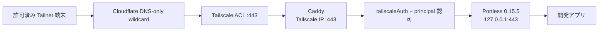

# Portless を Tailnet 内で安全に公開する実装計画

作成日: 2026-08-04

## ステータス

- 設計: 合意済み
- 実装: 完了、deploy 未実施
- 対象ホスト: `ryobox`
- 公開範囲: Tailscale tailnet 内のみ
- 公開 URL: `https://<name>.p.ryobox.xyz`

実装メモ: 実装時の最小権限化により、専用 CA + leaf ではなく、`*.p.ryobox.xyz` の自己署名 leaf を Caddy に直接 pin する構成へ簡略化した。これにより CA 秘密鍵を新設せず、Portless が保持する鍵から別証明書を発行できない。以降の CA 記述は設計時の候補であり、実装の source of truth は `nix-config/hosts/ryobox/portless.nix` と `docs/runbooks/portless.md` とする。

## 目的

NixOS 上で Portless 0.15.5 を再現可能かつ監査可能な system service として動かし、tailnet 内の許可済み端末から、Portless の URL を書き換えず HTTPS で利用できるようにする。

### 非目標

- Portless をインターネットへ公開しない。
- Tailscale Funnel、Portless の `--tailscale` / `--lan`、平文 HTTP は使わない。
- `.localhost` の名前解決や `/etc/hosts` 同期に依存しない。
- 複数ラベルの worktree 名を wildcard DNS で扱わない。ホスト名は `<name>.p.ryobox.xyz` の 1 ラベルに限定する。
- Portless の upstream や community flake の更新を自動追従しない。

## 採用方針

1. `ningen/dotfiles` の `buildNpmPackage` 構造を参考に、Portless をこの repo のローカル package として持つ。
2. npm の Portless 0.15.5 artifact を SHA-512 で固定し、Node.js 24 を明示する。
3. 1024 未満の port で無条件に `sudo` を起動する処理へ、明示的な opt-in 環境変数による回避 patch を当てる。
4. Portless は非 root user で動かし、systemd から `CAP_NET_BIND_SERVICE` だけを付与する。
5. Portless は loopback の 443、Caddy は Tailscale interface の IP の 443 だけで listen する。
6. Caddy が外向き TLS、認証、認可を担当し、Portless との間も固定 wildcard 証明書で TLS 接続する。
7. DNS-01、Tailscale ACL、`tailscaleAuth`、Caddy の明示的な principal 認可をすべて通過した通信だけを許可する。

community flake に依存して大幅な override を重ねる案は採用しない。依存関係 0 件の小さな npm bundle、patch、Node version、artifact hash を同じ repo で明示した方が、更新差分と実行内容を監査しやすいためである。

## 完成時の構成



Caddy と Portless は同じ TCP port を使うが、listen address が異なる。Caddy は `100.116.123.65:443` と `fd7a:115c:a1e0::a736:7b41:443`、Portless は `127.0.0.1:443` に限定する。

## セキュリティ不変条件

- Portless の package、Node.js、npm artifact、patch は Nix evaluation から一意に決まる。
- 実行時に `npm`、`mise`、`sudo`、network download を使わない。
- Portless process は root で動かさず、付与 capability は `CAP_NET_BIND_SERVICE` だけにする。
- `PORTLESS_ASSUME_BIND_CAPABILITY=1` は systemd service 内だけに設定し、shell の共通環境には出さない。
- Caddy は全 interface に bind しない。Portless は loopback 以外に bind しない。
- Portless の動的 SNI 証明書生成は使わず、`*.p.ryobox.xyz` の固定 leaf 証明書だけを渡す。
- 内部 CA の秘密鍵は repo、Nix store、ryobox のいずれにも配布しない。
- Caddy から Portless への TLS 検証を無効化しない。`tls_insecure_skip_verify` は禁止する。
- wildcard vhost は認証だけでなく、許可する Tailscale login を明示して認可する。
- ACL の principal 集合は、既存の ryobox:443 への許可範囲を広げない。
- Portless の停止は wildcard vhost の 502 に閉じ、既存 Caddy vhost を巻き込まない。

## 変更予定ファイル

最終的な名前は既存 module 構造に合わせるが、責務は次のように分離する。

| ファイル | 変更内容 |
| --- | --- |
| `nix-config/packages/portless/default.nix` | npm artifact の取得、metadata 検証、Node 24 の `buildNpmPackage` |
| `nix-config/packages/portless/no-sudo.patch` | capability 使用時だけ sudo 分岐を回避する最小 patch |
| `nix-config/packages/portless/package-lock.json` | build 用の最小 lock file |
| `nix-config/packages/portless/tests.nix` | package、patch、bind 権限の検証 |
| `nix-config/modules/services/portless.nix` | Portless systemd service と hardening |
| `nix-config/modules/services/tailscale-address-ready.nix` | Tailscale IP が interface に存在することの確認 |
| `nix-config/hosts/ryobox/default.nix` | module import、Caddy bind、firewall、service 有効化 |
| `nix-config/flake.nix` | local package と check の公開 |
| `nix-config/secrets/secrets.nix` | wildcard leaf private key の agenix recipient 定義 |
| `nix-config/secrets/portless-tls-key.age` | 暗号化した wildcard leaf private key |
| `nix-config/certs/portless-internal-ca.crt` | 公開可能な内部 CA 証明書 |
| `nix-config/certs/portless-wildcard.crt` | 公開可能な wildcard leaf 証明書 |
| `nix-config/home/default.nix` | immutable な `pkgs.portless` CLI の導入 |
| `dot-config/config/mise/config.toml` | Portless の `latest` 管理を削除 |
| `dot-config/config/mise/mise.lock` | Portless の lock entry を機械的に削除 |
| `docs/runbooks/portless.md` | 証明書更新、deploy、確認、rollback 手順 |

既存 module の配置規約と衝突する場合は、責務を保ったまま既存ディレクトリへ統合する。

## 実装単位

### 0. 事前 inventory と rollback 基点の記録

実装前に現在状態を保存し、deploy 中の挙動を比較できるようにする。

1. `ryobox` の current system generation と `/run/current-system` の実体を記録する。
2. Caddy の全 vhost、listen address、firewall port、Tailscale Serve の 8443/8444 を記録する。
3. `tailscale0` に対象 IPv4/IPv6 が実際に付与されていることを確認する。
4. tailnet policy から ryobox:443 に到達できる principal 集合を列挙する。
5. 現在動いている別 repo 由来の Portless v0.12.0、`PORTLESS_PORT=1355`、登録 route を記録する。
6. 既存 Caddy vhost ごとに認証・認可の有無を inventory する。

完了条件:

- rollback 先を generation 番号ではなく Nix store path で特定できる。
- 新しい wildcard vhost の principal 集合が既存 ryobox:443 の集合を拡大しないと判断できる。
- 既存 vhost と Portless route の疎通結果が baseline として残っている。

### 1. Portless のローカル Nix package 化

`buildNpmPackage` の source は npm registry の 0.15.5 tarball とし、次の integrity を固定する。

```text
sha512-zmJu4Q8/fY54oVUT/5NnmF4Ih8wTdCvCf6JCN783dRYl9mXkJBzXSckX2lztGCLIbM70varDjCudAbGKT73XPg==
```

実装手順:

1. hash 検証後の元 artifact について、`name=portless`、`version=0.15.5`、`engines.node=>=24`、`bin=./dist/cli.js`、依存関係 0 件、`install` / `postinstall` script 不在、Apache-2.0 を assertion で確認する。
2. `nodejs_24` を `buildNpmPackage` と runtime wrapper の両方へ明示する。
3. build に必要な最小 `package-lock.json` を repo に置く。元 artifact の metadata 検証より先に書き換えない。
4. `dist/cli.js` の sudo 条件へ `PORTLESS_ASSUME_BIND_CAPABILITY !== "1"` を追加する最小 patch を当てる。
5. patch の対象行が upstream 更新で一致しなくなった場合は build を失敗させ、曖昧な置換をしない。
6. flake package として `portless` を公開し、Home Manager と NixOS module が同じ derivation を参照する。

package check:

- `portless --version` が `0.15.5` を返す。
- runtime closure に Node 24 が含まれ、Node 20 以下を参照しない。
- `npm`, `mise`, `sudo` が runtime closure / wrapper PATH に入らない。
- opt-in 環境変数なしで非 root が 443 を要求した場合、sudo を暗黙実行せず失敗する。
- opt-in と capability が両方ある場合だけ、非 root で 443 に bind できる。
- capability なしで opt-in だけを指定しても 443 bind は kernel に拒否される。

### 2. 固定 wildcard 証明書の準備

Portless の任意 SNI に対する動的証明書生成を避けるため、専用の内部 CA から `*.p.ryobox.xyz` だけを SAN に持つ leaf 証明書を発行する。

1. offline 環境で専用 CA を作成するか、既存の用途分離された内部 CA を利用する。
2. leaf の SAN が `DNS:*.p.ryobox.xyz` のみで、適切な EKU、key usage、有効期限を持つことを検証する。
3. CA 証明書と leaf 証明書だけを repo に追加する。
4. leaf private key は agenix で暗号化し、ryobox だけが復号可能な recipient に限定する。
5. systemd の `LoadCredential` で private key を service に渡し、永続的な平文 file を作らない。
6. 有効期限監視、更新猶予、失効・再発行、緊急 rotation を runbook に記載する。

人手が必要な境界:

- CA private key の生成・保管と leaf への署名は repo 外で行う。
- 秘密鍵の commit 前に、`git diff --cached` と agenix file の暗号化状態を人が確認する。

完了条件:

- `openssl verify` が専用 CA に対して成功する。
- wildcard は 1 ラベルだけに一致し、`a.b.p.ryobox.xyz` には一致しない。
- CA private key と平文 leaf private key が repo と Nix store に存在しない。

### 3. hardened Portless system service の実装

service は既存 user `ryo-morimoto` で動かし、状態領域だけ `/var/lib/portless` に作る。

主要設定:

```text
User=ryo-morimoto
StateDirectory=portless
StateDirectoryMode=0700
AmbientCapabilities=CAP_NET_BIND_SERVICE
CapabilityBoundingSet=CAP_NET_BIND_SERVICE
NoNewPrivileges=true
PORTLESS_ASSUME_BIND_CAPABILITY=1
PORTLESS_SYNC_HOSTS=0
PORTLESS_TLD=p.ryobox.xyz
```

起動引数は Nix module で固定する。

```text
portless start --foreground --port 443 --https --tld p.ryobox.xyz \
  --cert <wildcard-leaf.crt> --key <systemd-credential-path>
```

追加 hardening:

- `ProtectSystem=strict`
- `ProtectHome=true`
- `PrivateTmp=true`
- `PrivateDevices=true`
- `ProtectKernelTunables=true`
- `ProtectKernelModules=true`
- `ProtectControlGroups=true`
- `RestrictSUIDSGID=true`
- `LockPersonality=true`
- `MemoryDenyWriteExecute=true` は Node.js 24 で実測し、起動を壊す場合だけ理由付きで外す。
- `RestrictAddressFamilies=AF_UNIX AF_INET AF_INET6`
- PATH は Nix store の必要 executable だけにする。

service の依存関係:

- network readiness の後に起動する。
- Caddy からは `Wants=` と `After=` のみとし、`Requires=` や `BindsTo=` は使わない。
- Portless の失敗や再起動で Caddy を停止させない。

可能なら NixOS VM test を追加し、非 root + capability で 443 bind が成功すること、capability なしでは失敗すること、秘密鍵 credential が service user 以外から読めないことを確認する。

### 4. Caddy の bind 範囲を先に狭める

Portless を 443 で起動する前に、Caddy の listen address を Tailscale IP だけへ変更する。この段階では wildcard vhost をまだ有効にしない。

1. Caddy global option に対象 IPv4/IPv6 の `default_bind` を設定する。
2. `tailscale-address-ready.service` を追加し、`tailscale0` が up であるだけでなく、期待する IPv4/IPv6 が実際に付与されていることを検査する。
3. Caddy は address readiness の後に起動する。ただし timeout 時のログと手動 recovery 手順を用意する。
4. HTTPS-only とし、`auto_https disable_redirects` を設定する。
5. `tailscale0` の TCP 80 firewall 許可を削除する。
6. 8443/8444 の Tailscale Serve を現状どおり維持する必要があるか確認し、必要なら両方を宣言的に復元する。

deploy gate:

- 既存 vhost `collie`、`plane`、`git`、`hermes`、`agent-canvas` が tailnet 内から HTTPS で利用できる。
- LAN、WAN、非 Tailscale interface から 80/443 に到達できない。
- Caddy の socket が wildcard address ではなく対象 Tailscale IP のみに存在する。
- 失敗した場合は、記録済み store path へ戻してから次へ進まない。

### 5. Portless service を loopback:443 で起動する

1. 別 repo の Devbox/mise から動いている Portless v0.12.0 を停止する。
2. route 一覧を退避し、古い process が再起動しないことを確認する。
3. NixOS service を有効化し、`127.0.0.1:443` だけに bind していることを確認する。
4. Caddy と Portless が同時に TCP 443 を listen できることを確認する。
5. test app を `portless <name> <command>` で登録し、loopback から正しい Host/SNI を与えた TLS request が成功することを確認する。

deploy gate:

- Portless process の UID が root ではない。
- effective capability が `cap_net_bind_service` のみである。
- loopback 以外に Portless socket がない。
- 未登録 route、異なる TLD、複数ラベルの hostname が意図どおり拒否される。
- service restart 後も route/state の挙動が仕様どおりである。

### 6. DNS、ACL、Caddy wildcard vhost を接続する

外部状態を変更するため、実施直前に対象と rollback 値を人が確認する。

1. Cloudflare に DNS-only の `*.p.ryobox.xyz` A/AAAA を作り、ryobox の Tailscale IPv4/IPv6 を指定する。Cloudflare proxy は無効にする。
2. tailnet policy を確認し、既存の ryobox:443 への許可 principal を広げずに利用する。
3. Caddy に `*.p.ryobox.xyz` vhost を追加し、Cloudflare DNS-01 で外向き証明書を取得する。
4. wildcard vhost に `tailscaleAuth` を適用する。
5. `tailscaleAuth` が返す login 情報を、明示した allowlist と照合する。認証済みという理由だけで全 tailnet user を通さない。
6. upstream は `https://127.0.0.1:443` とし、original Host を保持する。
7. Caddy transport に専用内部 CA を trust pool として設定し、TLS server name に request host を渡す。
8. Portless service が停止している場合は wildcard vhost だけを 502 にし、他の vhost を正常に保つ。

注意:

Tailscale ACL は L4 の IP:port 単位であり、同じ ryobox:443 上の Caddy vhost を hostname ごとに分離できない。新しい利用者へ Portless だけを開ける要求が出た場合、この構成の ACL を拡張してはならない。別 Tailscale identity/IP を持つ ingress へ分離する設計に戻る。

deploy gate:

- allowlist 内の端末から `https://<name>.p.ryobox.xyz` が有効な公開証明書で成功する。
- allowlist 外の tailnet user は、route の存在にかかわらず Caddy で拒否される。
- tailnet 外、直接 WAN、Cloudflare proxy 経由から到達できない。
- upstream の証明書名または CA が不正なら Caddy が接続を拒否する。
- Host header が Portless まで保持され、別 route へ混線しない。

### 7. 開発者向け CLI を immutable package へ移行する

1. Home Manager に同じ `pkgs.portless` を追加する。
2. `mise` の `portless = "latest"` と対応 lock entry を削除する。
3. shell には `PORTLESS_TLD=p.ryobox.xyz`、`PORTLESS_HTTPS=1`、`PORTLESS_SYNC_HOSTS=0` を設定する。
4. `PORTLESS_ASSUME_BIND_CAPABILITY` は shell に設定しない。
5. 既存 route の command と hostname を 1 ラベル形式へ移行する。
6. 別 repo の Devbox や npm global install は、この repo の変更範囲外として一覧化する。変更が必要なら対象 repo ごとに明示的な許可を得る。

完了条件:

- interactive shell の `portless` が Nix store の 0.15.5 を参照する。
- `mise`、Devbox、npm global の binary が system service 起動経路に入らない。
- login shell の再作成後も route 登録と URL 表示が期待どおりである。

### 8. 総合検証、再起動、runbook 完成

静的検証:

```sh
nixfmt <変更した Nix ファイル>
nix flake check ./nix-config
nix build ./nix-config#packages.x86_64-linux.portless
nixos-rebuild dry-build --flake ./nix-config#ryobox
```

実環境検証:

1. allowlist 内 / 外 / tailnet 外の 3 経路で access matrix を確認する。
2. IPv4 と IPv6 の両方で外向き TLS、Caddy auth、内部 TLS、route が成立することを確認する。
3. Portless、Caddy、Tailscale の各 service を単独 restart し、依存関係と failure isolation を確認する。
4. Portless を停止し、wildcard vhost だけが失敗して既存 vhost が生きることを確認する。
5. Caddy が誤った CA、期限切れ leaf、誤った hostname の upstream を拒否することを確認する。
6. `ryobox` を再起動し、Tailscale address readiness、Caddy、Portless、既存 Tailscale Serve が宣言状態へ収束することを確認する。
7. journal に secret、credential path の内容、不要な sudo prompt が出ていないことを確認する。
8. 証明書更新と全 stage の rollback を runbook だけで再現できることを確認する。

## 推奨する commit と deploy の分割

| 段階 | commit の内容 | deploy | 次へ進む条件 |
| --- | --- | --- | --- |
| A | local package、sudo 回避 patch、package/VM checks | なし | build と test が成功 |
| B | 証明書、agenix、Portless module。service は未起動 | なし | secret と closure の監査完了 |
| C | Caddy bind 限定、address readiness、port 80 削除 | あり | 全既存 vhost が正常 |
| D | Portless service 有効化、旧 process 停止 | あり | loopback:443 と capability 検証成功 |
| E | DNS/ACL 確認、wildcard vhost、認証・認可 | あり | access matrix が全件成功 |
| F | Home Manager/mise 移行、runbook、最終 test | あり | reboot test と rollback rehearsal 成功 |

各 deploy の間に観測時間を置き、複数 stage を 1 回の NixOS switch にまとめない。特に旧 Caddy の `*:443` と新 Portless の `127.0.0.1:443` は同時起動できないため、Caddy bind 限定を先に完了させる。

## rollback

単純な `--rollback` や「1 generation 前」に依存しない。開始時と各 stage の `/nix/store/...-nixos-system-ryobox-...` を記録し、明示した store path で切り戻す。

1. wildcard Caddy route を無効化する。
2. Portless system service を停止する。
3. DNS wildcard と tailnet policy を変更前の値へ戻す。
4. Caddy bind 変更前の記録済み system generation を activate する。
5. 必要な場合だけ、退避した旧 Portless v0.12.0 process と route を復元する。
6. 既存 vhost、Tailscale Serve、firewall、listen socket を baseline と比較する。

Caddy を旧 `*:443` 構成へ戻す前に Portless を必ず停止する。順序を逆にすると port 競合で Caddy の復旧を妨げる。

## リスクと軽減策

| リスク | 軽減策 |
| --- | --- |
| upstream の sudo 分岐変更で patch が誤適用される | context 固定 patch と source assertion で build を fail closed にする |
| capability bypass 環境変数だけで安全だと誤認する | capability なしの bind 失敗 test を持ち、kernel enforcement を検証する |
| Caddy と Portless の 443 が競合する | bind address 変更を独立 stage とし、socket を確認してから Portless を起動する |
| Tailscale IP 変更で Caddy が起動しない | address readiness の明示的な失敗ログ、IP 更新手順、旧 generation を用意する |
| ACL 追加で既存 Caddy vhost まで露出する | principal 集合を拡張しない。必要なら ingress identity/IP を分離する |
| Portless の任意 SNI 証明書生成 | 1 ラベル wildcard の固定 leaf を渡す |
| 内部 TLS の検証無効化 | 専用 CA trust pool と request host の SNI 検証を必須にする |
| leaf key 漏えい | agenix + systemd credential、CA key offline、rotation runbook を使う |
| Portless 障害が全 Caddy を止める | `Wants` / `After` のみ、wildcard vhost 単位で 502 に閉じる |
| mise/npm の mutable binary が混入する | system service と CLI を同じ Nix derivation に統一する |
| reboot 後に Tailscale Serve 8444 が消える | 現状を inventory し、必要な 8443/8444 を両方宣言化する |

## 最終受け入れ条件

- WHEN 許可済み tailnet 端末で Portless route を登録し `https://<name>.p.ryobox.xyz` を開く、THEN URL を書き換えず有効な HTTPS として対象 app に到達する。
- WHEN 未許可の tailnet user または tailnet 外から同じ URL を開く、THEN app や Portless へ到達する前に拒否される。
- WHEN Portless が停止・異常終了する、THEN wildcard vhost だけが失敗し、既存 Caddy vhost は継続する。
- WHEN capability、内部 CA、SNI のいずれかが欠落・不正である、THEN安全でない fallback をせず接続または起動が失敗する。
- WHEN `ryobox` を再起動する、THEN Tailscale address の準備後に全 service が宣言状態へ収束し、手動の `npm`、`mise`、`sudo` 操作を必要としない。
- WHEN package source を監査する、THEN Portless 0.15.5、npm SHA-512、Node 24、sudo 回避 patch、依存関係 0 件を repo 内だけで確認できる。
