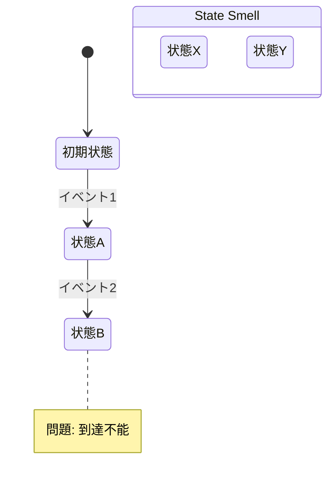

# State Modeling リファレンス

状態空間 (Q, Σ, δ) の形式的モデル化を通じて、型設計の抜け漏れを体系的に検出する手法。

参考: 原昌輝「状態設計から『なんとなく』を無くそう」(Wantedly Tech Lunch, 2023)

## 状態空間の定義

状態空間を3つ組 (Q, Σ, δ) として定義する：

- **Q**: 状態集合 — システムが取りうる全ての状態
- **Σ**: 入力集合 — 状態を変化させる全てのイベント/コマンド
- **δ**: 状態遷移関数 — δ: Q × Σ → Q

## 4つのアノマリー

### (1) 到達不能アノマリー (Unreachable States)

- **定義**: 初期状態からどの入力列でも到達できない状態
- **形式**: q ∈ Q が到達不能 ⟺ ∀σ ∈ Σ*, δ*(q₀, σ) ≠ q
- **型設計への示唆**: 和型のバリアントに、実際には生成されないケースが存在する
- **対処**: 状態（型バリアント）を削除

### (2) 状態不足アノマリー (Missing States)

- **定義**: 必要な状態が定義されていない
- **形式**: ∃入力列 σ で δ*(q, σ) が未定義
- **型設計への示唆**: 和型にバリアントが足りない。エラー状態、中間状態、エッジケースの型が欠落
- **対処**: 状態（型バリアント）を追加

### (3) 重複アノマリー (Duplicate States)

- **定義**: 区別不要な状態が複数存在
- **形式**: ∃q₁, q₂ ∈ Q, q₁ ≠ q₂ だが ∀σ ∈ Σ, δ(q₁, σ) ≡ δ(q₂, σ)
- **型設計への示唆**: 同じ振る舞いの型が複数定義されている（型肥大の兆候）
- **対処**: 状態（型）を統合

### (4) 情報不足アノマリー (Non-Determinism)

- **定義**: 同じ状態・同じ入力で異なる遷移先が必要
- **形式**: δ が関数でなく関係になっている
- **型設計への示唆**: 型の粒度が粗すぎる。同じ型の中に、異なる文脈で異なる振る舞いが必要なデータが混在
- **対処**: 状態（型）を分割

## State Smell: 情報消失パターン

**定義**: 異なる状態から同じ入力で同じ状態に合流するパターン。

```
q₁ ─σ→ q₃
      ↗
q₂ ─σ→
```

**検出手順**:
1. 合流点 q₃ を特定
2. 合流後の遷移 δ(q₃, σ') を確認
3. q₁ から来た場合と q₂ から来た場合で、望ましい遷移先が異なるか検討
4. 異なる場合、q₃ を分割して文脈を保持すべき

**型設計への示唆**: 和型のバリアントが足りず、過去の文脈情報が失われている。「型不足」の一種。

**例**: フォロー機能で「無視」→「アンフォロー」→「フォロー」とすると、「無視された」という情報が消失し、リクエストが復活する。「未フォロー」と「未フォロー+被無視」は別の型（状態）であるべき。

## 状態ストアとライフサイクル

### 原則: 異なるストアは異なるライフサイクルを持つ

| ストア | 初期化タイミング | 消去タイミング |
|---|---|---|
| Server DB | ユーザー作成時 | 退会時 |
| Browser localStorage | 新ブラウザでアクセス時 | 明示的クリア |
| Browser sessionStorage | タブ開設時 | タブ/ブラウザ終了時 |
| URL query/fragment | URL発行時 | ナビゲーション時 |
| History data | ページ遷移時 | ブラウザ終了時 |
| In-memory state (Redux等) | アプリ起動時 | アプリ終了時 |
| Component state | マウント時 | アンマウント時 |

### Phase 0 での使い方

棚卸し時に、各データ項目の**ストアとライフサイクル**も記録する：

```markdown
- [KNOWN] ユーザーの認証状態
  - ストア: Server DB + Browser cookie
  - ライフサイクル: ログイン時初期化、セッション期限切れで消去
  - 同期リスク: cookie期限切れ後にサーバー状態との不一致
```

## 隠れ状態 (Hidden States)

### 定義

複数のストアが正しく同期されている間は到達しないが、同期が破れると到達する状態。

### 形式的表現

Q = Q₁ × Q₂ で Σ = Σ₁ ⊎ Σ₂（独立な入力）の場合：
- **同期時の到達可能状態**: 正常な遷移で到達する Q₁ × Q₂ の部分集合
- **隠れ状態**: 同期が破れた場合にのみ到達する Q₁ × Q₂ の要素

### 検出手順

1. 複数ストアにまたがる状態を特定
2. 直積空間 Q₁ × Q₂ の全状態を列挙
3. 同期が取れている場合の到達可能状態を特定
4. 同期が破れた場合の隠れ状態を特定
5. 隠れ状態での振る舞いが定義されているか確認

### 型設計への示唆

隠れ状態が存在する場合、型定義では以下のいずれかが必要：
- トランザクション境界を明示する型（アトミック操作の保証）
- 不整合状態を表現する型バリアント（同期エラーのハンドリング）
- 楽観的ロックのための版数型

### 例: 決済後ブラウザバック

```
サーバー: 決済完了 × クライアント: 未決済画面表示
```

この隠れ状態が発生する原因: History data のライフサイクルがサーバー状態と独立。
対処: 冪等性トークン型、またはクライアント状態の再取得メカニズム。

## 状態遷移図 (Mermaid) の生成

分析結果を可視化する際のMermaid形式：



## Domain Modeling との統合ポイント

### Phase 0 での追加作業

棚卸し時に以下も列挙する：
- 各データのストア（置き場所）
- 各ストアのライフサイクル（初期化・消去タイミング）
- ストア間のライフサイクル差異

### Phase 3 での追加検出

通常の4カテゴリ（型不足/型肥大/分岐漏れ/シグネチャ不一致）に加えて：
- **到達不能バリアント**: 和型に実際には到達しないバリアントがないか
- **状態不足**: エラー状態、中間状態、タイムアウト状態の型が欠落していないか
- **情報消失**: 異なる文脈が同じ型に合流して区別不能になっていないか
- **隠れ状態**: 複数ストアの同期が破れた場合の型が定義されているか

### Phase 5 での追加判定

構造的欠陥の判定に以下を追加：
- 隠れ状態が3つ以上検出された → Phase 0 に戻り、ストア設計を見直す
- State Smell が繰り返し検出される → 和型のバリアント設計を根本から見直す
