# Architecture (Background and components)

## Design overview

sandbox-broker is a per-project long-lived **L2 permission broker**: it sits
between an AI coding agent's `PreToolUse` hook and the host machine, and
returns `allow` / `deny` / `ask` for each filesystem / network / command
operation the agent attempts. The broker is one Rust binary that is
spawned as a daemon per project and talks to per-agent hook adapters over a
Unix domain socket.

Key decisions for this rewrite:

- **L2 verdict-only by default; L1 wrap is an opt-in escalation**. The
  broker decides; it does not by default rewrite the agent's command into
  a kernel sandbox. A future `runtime.wrap_allowed_bash` flag will allow
  wrapping into [landrun](./refs/landrun.md) for deeper enforcement, but
  this is Phase 2+.
- **Single binary, multi-agent**. The historical `claude-code-hook.sh` and
  `codex-hook.sh` adapters are replaced by `sandbox-broker hook claude` and
  `sandbox-broker hook codex` subcommands of the same Rust binary, sharing
  one evaluator behind thin shape adapters. The pattern is borrowed from
  [Fence](./refs/fence.md).
- **Asymmetric defaults**. `Policy::default()` is no longer "deny
  everything → escalate". Read defaults to allow with a deny-list of
  secrets; write and network default to deny with explicit allow-lists.
  Borrowed from [sandbox-runtime](./refs/sandbox-runtime.md) and Fence.
- **Mandatory-deny bedrock**. A build-time hard-coded list of paths
  (`~/.bashrc`, `.git/hooks/**`, `.mcp.json`, `.claude/commands/**`,
  `.codex/**`, `.sandbox/policy.toml`) is denied for write before any user
  policy is consulted. The agent can never rewrite its own permissions.
- **Daemonize-by-default with declarative deploy**. `sandbox-broker start`
  daemonises and writes a PID file; Nix Home Manager owns the hook
  registration. The broker process is the single produced artifact.

This document is organised as **Background** (why the existing broker
needs replacing) → **Architecture** (layer positioning / component map /
public surface) → **Key design decisions**.

## Background

### Problem

The existing in-tree broker has shipped for a few weeks of personal
dogfooding and three concrete UX failures have surfaced:

| Symptom | Root cause | Fixed in this design |
|---|---|---|
| `sandbox-broker: no socket at /…/.sandbox/broker.sock, denying` blocks every Bash/Read/Edit when the broker isn't running for a project | Hook script's no-socket branch is fail-closed | Hook subcommand's no-broker branch is fail-open passthrough |
| `Policy::default()` is a deny-everything escalate, so the broker is unusable until the user authors a non-trivial `policy.toml` | No default template; missing-policy fall-back is `Policy::default()` (deny-all) | Built-in `@builtin/code` template; `init` writes it; missing-policy is hard-fail at start |
| Two `.sh` adapters duplicate jq/curl/JSON-shape logic, each broken differently (e.g. jq parse error in claude adapter) | No shared evaluator; bash chosen for distribution simplicity | Shared evaluator in Rust, two `hook` subcommands of the broker binary; `.sh` files removed |

A fourth, structural problem motivates the full rewrite: the existing
crate has organic module structure (`broker.rs`, `subagent.rs`,
`worktree.rs`, `persist.rs` mixed together) that fails to express the
**verdict chain** as a first-class concept. Adding a new stage (e.g. a
mandatory-deny layer) currently requires touching three files; with the
rewrite, each stage is its own module behind a typed trait.

The current broker also has **no observability story**: `session log`
shows grants but not denials, and there is no equivalent to "explain why
this op got denied". Users debugging a deny resort to reading code.

### Goals

1. **Usable defaults** — a fresh `sandbox-broker init` produces a policy
   that lets a typical AI agent run without prompts on read-mostly tasks
   (`git status`, `cat README`, fetching docs from `api.anthropic.com`)
   and reliably stops the dangerous ones (`rm -rf`, write to `.env`,
   network to `169.254.169.254`).
2. **Multi-agent unified** — Claude Code and Codex (and future agents)
   share one decision core; per-agent code is the JSON shape adapter only.
3. **Declaratively deployed** — `home/agents/default.nix` registers the
   broker binary's `hook` subcommands; no `.sh` shipped artefacts to drift
   against the binary.
4. **Auditable** — every verdict goes to a ring buffer with rule
   provenance; `sandbox-broker explain <op>` replays the chain and shows
   which rule fired and why.
5. **Fail-safe by default but degradeable** — hook subprocess errors
   fail-open (Codex pattern, prevents a buggy hook from bricking the
   session); security-critical paths (mandatory-deny, invalid policy at
   start) fail-closed.

### Inspiration

We studied 8 tools across three layers (process-level kernel sandboxes,
in-process policy engines, workspace VM platforms); the full reports are
in [`./refs/`](./refs/) and the synthesis is in
[`./refs/synthesis.md`](./refs/synthesis.md).

The most directly transferable patterns:

- **[Fence](./refs/fence.md)** — same problem domain (multi-agent
  permission manager). We borrow: per-agent thin shape adapter + shared
  evaluator (`cmd/fence/hooks_runtime.go:81`); `extends` template
  inheritance; mandatory-deny list independent of user policy. We **do
  not** borrow: per-invocation lifecycle (Fence has no daemon; we keep a
  daemon for session state and audit log) or whole-process sandbox wrap
  by default (Fence's `fence -- claude` model — we leave that as a Phase
  2+ opt-in).

- **[Codex CLI](./refs/codex.md)** — closest L2 architectural cousin.
  We borrow: prefix-rule with parse-time-validated `examples` /
  `not_examples`; explicit verdict source attribution; amendment proposal
  flow ("allow and remember" → durable policy diff). We **do not** borrow
  Starlark as a DSL surface (TOML is enough for our scope and is what
  agents already author).

- **[sandbox-runtime](./refs/sandbox-runtime.md)** — Anthropic's
  per-invocation wrapper. We borrow: asymmetric defaults by category
  (read-allow / write-deny / net-deny); domain pattern hardening (reject
  bare `*` / `*.com`; canonicalise hosts; refuse IP wildcards); the
  in-memory violation ring buffer pattern.

- **[Landrun](./refs/landrun.md)** — Landlock primitive. Phase 2+
  candidate for `wrap_allowed_bash`. We do not depend on Landlock at
  Phase 1; the broker remains useful even on kernels that lack it.

We **explicitly reject** the abstractions of the L3 tools (E2B / Daytona
/ agent-infra / Windmill) for our local-machine scope. They isolate the
agent in a VM or container, which is a different threat model. Their
operational patterns (cleanup-stack, capability probe at boot,
`oom_score_adj=1000`) are still borrowed where applicable.

---

## Architecture

### Layer positioning

The broker sits at L2 in a three-layer landscape:


| Layer | Role | Examples | Broker relationship |
|---|---|---|---|
| **L1 — kernel sandbox primitive** | Wraps a single command in `bwrap` / Landlock / Seatbelt + seccomp | `landrun`, `srt`, Fence-wrap mode | Optional escalation (Phase 2+ via `wrap_allowed_bash`); broker remains useful without L1 available. |
| **L2 — in-process policy / hook engine** | Mediates per-tool decisions during agent runtime | **broker**, Codex CLI's hook engine, Fence's hook adapter | Where the broker lives. |
| **L3 — workspace VM / container** | Isolates the whole agent in a VM/container | E2B, Daytona, agent-infra | Compatible (broker can run inside an agent container too); not a substitute. |

L1 and L3 are complementary, not substitutes. A user who runs the agent
inside a Daytona container can still benefit from the broker's per-tool
decisions and audit log.

### Component map



The broker binary (`sandbox-broker`) is composed of these modules:

```
sandbox-broker
├── cli                # clap-based subcommand dispatch
├── policy/
│   ├── parse          # TOML deserialise + extends resolution
│   ├── validate       # examples/not_examples validation, domain hardening
│   └── templates      # built-in @builtin/code, code-strict, git-readonly (include_str!)
├── matcher/
│   ├── prefix_rule    # tokenwise argv prefix match
│   ├── path_glob      # fs path glob (allow vs deny)
│   └── domain_pattern # network domain match
├── evaluator          # the seven-stage verdict chain
├── verdict            # Verdict struct + Source + Risk + amendment_proposal
├── mandatory_deny     # build-time bedrock list (not user-overridable)
├── operation          # internal Operation enum (FileRead / FileWrite / FileDelete / CommandExec / Connect)
├── session            # session state (grants), TOML-persisted
├── audit              # ring buffer + structured log
├── server             # UDS + JSON-RPC + cleanup hook
├── cleanup            # LIFO + priority cleanup stack (e2b pattern)
├── lifecycle/
│   ├── daemonize      # self-reexec --foreground
│   ├── pid_file       # PID file write/read/lock
│   └── capability     # boot probe (Landlock kernel ABI / bwrap presence)
└── hook/
    ├── shared         # the unified evaluator (translates agent JSON ↔ Operation/Verdict)
    ├── claude         # Claude PreToolUse JSON shape
    └── codex          # Codex hook JSON shape
```

Three primary call flows:

1. **Hook flow** (the hot path, called per agent tool invocation):
   ```
   agent → hook (e.g. Claude PreToolUse) → bash adapter (deprecated)
                                         → sandbox-broker hook claude (new)
                                         → hook::claude::translate → Operation
                                         → UDS RPC to running broker
                                         → server::handle → evaluator::evaluate
                                         → Verdict → hook::claude::format → permissionDecision JSON
                                         → agent
   ```

2. **Lifecycle flow** (daemon start / stop):
   ```
   user runs `sandbox-broker start`
     → cli → lifecycle::daemonize::spawn_self_foreground
     → child process: lifecycle::capability::probe
     → policy::parse::load_with_extends (hard-fail if invalid)
     → server::serve (UDS bound, signal handlers installed,
                      cleanup stack registered)
     → SIGTERM from `sandbox-broker stop` → cleanup unwinds
   ```

3. **Audit / debug flow** (out-of-band):
   ```
   user runs `sandbox-broker explain <op-json>` or `policy show` or `log --since 1h`
     → cli → audit::*  (no UDS round-trip; reads on-disk session/audit files)
   ```

### Public surface

The broker exposes two interfaces:

#### CLI subcommands

| Subcommand | Purpose | Daemon required? |
|---|---|---|
| `init [--template NAME]` | Write `.sandbox/policy.toml` from a built-in template | No |
| `start [--foreground]` | Daemonise (default) or run in foreground | No (it starts the daemon) |
| `stop` | Read PID file, send SIGTERM, wait for exit | Optional (best-effort) |
| `status` | Show project root / policy summary / running state | No |
| `doctor` | Capability probe (Landlock / bwrap / seccomp) and system check | No |
| `policy show` | Print resolved policy after `extends` merge, with provenance | No |
| `explain <op-json>` | Replay the verdict chain for one operation, show which rule fired | No |
| `log [--since DUR]` | Dump recent verdicts from the audit ring buffer | Yes |
| `learn` | Run in learning mode (record all ops, generate policy at end) | n/a (it IS the daemon) |
| `hook claude` | Hook entry point for Claude Code (read stdin, return permission JSON) | Yes |
| `hook codex` | Hook entry point for Codex (read stdin, return permission JSON) | Yes |

#### UDS protocol

A single Unix domain socket at `<base-repo-root>/.sandbox/broker.sock`.
Wire protocol is JSON over HTTP (using `axum`). Endpoints:

| Method + Path | Body | Response | Purpose |
|---|---|---|---|
| `POST /evaluate` | `Operation` (tagged enum: `{kind, detail}`) | `Verdict` | Synchronous verdict for one op (called by hook subcommand) |
| `POST /grant` | `{operation, source, persist_suggested}` | `{}` | Record a human-approved op into session state |
| `GET /policy` | – | resolved `Policy` | For `policy show` |
| `GET /session` | – | session grants list | For `log` |
| `GET /health` | – | `{"status": "ok"}` | Liveness check |
| `POST /shutdown` | – | `{}` | Graceful shutdown (alternative to SIGTERM) |

The hook subcommands are clients of `/evaluate`; they encode the agent's
input shape into an `Operation`, POST it, decode the `Verdict`, and emit
the agent's expected output shape.

### Worktree resolution

The broker is **per base repo**, not per worktree. When a project is
checked out as a git worktree, all worktrees share one broker daemon,
one socket, one policy, and one session state. Resolution:

```
project_dir (cwd or arg) →
  git rev-parse --git-common-dir →
  parent of that = base repo root →
  base/.sandbox/{policy.toml, broker.sock, broker.pid, broker.log,
                 session.toml, learned.toml, audit.log}
```

This is preserved from the existing implementation and lives in
`policy::parse::resolve_base_repo`.

### Key design decisions

- **Adopt L2 verdict-only at Phase 1**. Hook returns
  `permissionDecision`; the agent's tool then runs on the host without
  further confinement. This is the Codex / Claude Code shape and the
  baseline a broker must support to compose with either agent. L1 wrap
  via `landrun` is `runtime.wrap_allowed_bash` opt-in in Phase 2+.

- **One binary, two `hook` subcommands**. Eliminates the bash adapter
  drift class. The Rust subcommands share `hook::shared` for everything
  except agent-shape JSON. Modelled on
  [Fence's `evaluateShellHookRequest`](./refs/fence.md).

- **Asymmetric category defaults**. `read.default = "allow"` with a
  deny-list of secrets; `write.default = "deny"` with an allow-list of
  workspace-writable roots; `network.default = "deny"` with an allow-list
  of common dev domains. Without this, "no policy" means "all prompts",
  which makes the broker an obstacle, not a guard rail.

- **Mandatory-deny bedrock list is build-time hard-coded**. Users can
  add to `mandatory_deny.write.user_extra` but cannot remove the bedrock.
  Defends against an agent rewriting its own `policy.toml`,
  `.claude/commands/`, shell rc files, `.git/hooks/`. Borrowed from
  sandbox-runtime and Fence's `dangerous.go`.

- **Hard-fail on invalid policy at start**. The current broker silently
  falls back to `Policy::default()` (deny-all) when `policy.toml` is
  missing or malformed. The new design fails the `start` subcommand with
  a clear error, because "broker started fine but is denying everything"
  is the worst possible UX.

- **Hook subprocess errors fail-open**. If the broker is unreachable,
  crashed, or returns a malformed response, the hook subcommand exits
  with `permissionDecision: allow` (Claude) or silent exit-0 (Codex).
  Borrowed from Codex hooks. The trade-off is explicit: broker outage
  must not brick agent sessions; the security guarantee is "broker is
  enabled" not "broker is invulnerable".

- **Mandatory-deny enforced at hook time, not just broker time**. The
  hook subcommand has the bedrock list embedded too, so even if the
  broker is bypassed by a stale socket, fail-open does not leak through
  for `~/.bashrc` / `.git/hooks/**` writes. (Phase 1 polish: in Phase 1
  the bedrock is broker-side only; hook-side embedding is Phase 2.)

- **Daemonize-by-default with PID file + log file**. `start` (no flag)
  forks via self-reexec into `--foreground`, parent writes PID and
  exits. Log goes to `.sandbox/broker.log`. `stop` is `kill -TERM
  $(<broker.pid)`; daemon's signal handler runs cleanup. Borrowed from
  [portless](https://www.npmjs.com/package/portless) (CLI shape) and
  e2b's cleanup-stack (lifecycle ordering).

- **Capability probe at boot, cached**. `lifecycle::capability::probe`
  runs once at start (Landlock ABI level via `landlock_create_ruleset(0,
  0, LANDLOCK_CREATE_RULESET_VERSION)`, bwrap presence via PATH lookup)
  and writes the result to `.sandbox/capabilities.toml`. A policy that
  declares `runtime.wrap_allowed_bash = true` but no Landlock support is
  available fails at `start`, not at the first allow-with-wrap.
  Borrowed from [Windmill](./refs/windmill.md) and Codex.

---

## Public Rust API

The crate is consumed by:

1. **Its own `bin/sandbox-broker`** (the only producer artefact).
2. **Tests in `tests/`** — black-box: spawn the binary, send JSON over
   stdin to `hook claude` / `hook codex`, parse stdout. Plus white-box:
   import library modules to test `evaluator::evaluate`, `policy::parse`,
   `matcher::*` directly.

The library is **not** marketed as an embeddable crate at Phase 1.
`cargo publish` is out of scope. Public exports are scoped to the
modules tests need.
