# Matcher semantics

## Design overview

Three independent matchers — **prefix-rule** for argv, **path-glob** for
filesystem, **domain-pattern** for network — convert an `Operation` plus
a `Policy` into a `MatchResult` (`Allow` / `Deny` / `NoMatch`). The
matchers are deliberately small, pure, and testable in isolation.

Key decisions:

- **Three independent matchers, no super-matcher**. Each has its own
  semantics and testing surface. Stage-3 / 4 of the verdict chain
  selects the appropriate matcher per operation kind.
- **Prefix-rule is tokenwise, not regex**. Borrowed from
  [Codex execpolicy](./refs/codex.md#approval-policy-dsl). Predictable,
  no catastrophic backtracking.
- **Glob lib: `glob-match`** (already in `Cargo.toml`). Fast pattern-set
  match, no compilation cost per call.
- **Tilde expansion at parse time**, not at match time. Patterns are
  pre-expanded to absolute paths before being stored in the matcher.



## Prefix-rule

Used for `Operation::CommandExec { argv: Vec<String> }`. Pattern
language:

```rust
enum PrefixToken {
    Fixed(String),               // exact-match a single token
    Alternatives(Vec<String>),   // any of these matches one token
}

struct PrefixRule {
    first: String,                       // PrefixToken::Fixed enforced for first
    rest: Vec<PrefixToken>,
    decision: Decision,
    examples: Vec<Vec<String>>,
    not_examples: Vec<Vec<String>>,
    justification: Option<String>,
}
```

Semantics:

1. Argv must have at least `1 + rest.len()` tokens.
2. `argv[0]` must equal `first` exactly. (First-token fixed lets the
   matcher index rules by `first` for O(1) prefiltering — Codex
   pattern.)
3. For each `i`, `argv[i+1]` must match `rest[i]`:
   - `PrefixToken::Fixed(s)` → `argv[i+1] == s`
   - `PrefixToken::Alternatives(alts)` → `alts.contains(&argv[i+1])`

Argv tokens **after** `1 + rest.len()` are unconstrained; the rule
matches as long as the prefix matches. So `pattern = ["git", "log"]`
matches `["git", "log"]`, `["git", "log", "--oneline"]`, and
`["git", "log", "--graph", "-p"]`.

To deny a pattern only when extra tokens are present, write a rule with
`decision = "deny"` and a longer pattern. The first matching rule wins,
so put the more-specific rule earlier:

```toml
[[commands]]
pattern = ["git", "push", "--force"]
decision = "deny"
examples = [["git", "push", "--force"]]

[[commands]]
pattern = ["git", "push"]
decision = "ask"
examples = [["git", "push", "origin", "main"]]
```

### Indexing

Rules are loaded into `matcher::PrefixIndex`:

```rust
pub struct PrefixIndex {
    by_first: HashMap<String, Vec<PrefixRule>>,
}
```

`PrefixIndex::lookup(argv)` returns rules whose `first == argv[0]` in
file-declaration order. Iterating in order, the first rule whose `rest`
matches wins.

This is a near-direct port of Codex's `prefix_rule` matching
(`codex-rs/execpolicy/src/rule.rs`).

### Parse-time validation

For each rule, when parsing:

```
for example in examples:
    assert example matches the rule pattern OR PARSE_ERROR

for not_example in not_examples:
    assert not_example does NOT match the rule pattern OR PARSE_ERROR
```

This catches the most common authoring mistakes:

- Pattern requires more tokens than the example has (`["git", "push", "*"]`
  with example `["git", "push"]`)
- Forgot the `Alternatives` syntax and wrote `pattern = ["git", "log",
  "--oneline"]` when meaning "git log with any flag"

Validation happens once at policy load, not per match.

## Path glob

Used for `Operation::FileRead { path }`, `FileWrite`, `FileDelete`,
`FileRename`. Implementation: `glob_match::glob_match(pattern, path)`.

### Pattern syntax

Standard glob:

- `*` matches any sequence of characters within one path segment (no
  `/`)
- `**` matches any number of path segments
- `?` matches a single character
- `[abc]`, `[a-z]` character classes
- `{a,b,c}` brace expansion (handled by pre-expanding patterns at parse
  time into N patterns)

### Tilde expansion

`~/...` is expanded to `$HOME/...` at parse time. `~user/...` is
rejected as a parse error (we don't reach into `getpwnam`).

### Path normalisation

Operation paths are normalised before matching:

1. Resolve relative paths against the operation's `cwd` (or
   base-repo-root when no cwd).
2. Canonicalise `..` and `.` components.
3. Resolve symlinks **only when the target lives inside the project
   tree**. Cross-tree symlink resolution is out of scope at Phase 1
   (treating the symlink path as the policy target is the safer
   default).

### Filesystem precedence

The two filesystem categories have asymmetric semantics — see
[policy.md](./policy.md#filesystem) for the user-facing behaviour.
Internally:

```rust
fn check_read(policy: &Policy, path: &Path) -> MatchResult {
    if matches_any(&policy.filesystem.read.allow, path) {
        return MatchResult::Allow;
    }
    if matches_any(&policy.filesystem.read.deny, path) {
        return MatchResult::Deny;
    }
    // Read is "default = allow" so unknown is Allow, not NoMatch
    MatchResult::Allow
}

fn check_write(policy: &Policy, path: &Path) -> MatchResult {
    if matches_any(&policy.filesystem.write.deny, path) {
        return MatchResult::Deny;
    }
    if matches_any(&policy.filesystem.write.allow, path) {
        return MatchResult::Allow;
    }
    // Write is "default = deny" — but we return NoMatch so the chain
    // can fall through to programmatic_check. The eventual escalate
    // is what enforces deny-by-default.
    MatchResult::NoMatch
}
```

The asymmetry: `check_read` short-circuits to `Allow` on no match (so
read-by-default is allow), but `check_write` returns `NoMatch` so the
chain can layer on more checks (programmatic, escalate). This means
`escalate` is the operative no-match verdict for write — the user gets
asked, and the amendment proposal can suggest an `allow` rule.

## Domain pattern

Used for `Operation::Connect { host, port }`. Implementation:

```rust
pub fn match_domain(pattern: &str, host: &str) -> bool {
    // Parse pattern at config-load time; here just compare.
    match pattern {
        DomainPattern::Exact(p) => host == p,
        DomainPattern::SubdomainWildcard(suffix) => {
            // *.example.com → matches "x.example.com", "y.x.example.com"
            // does NOT match "example.com" itself
            host.ends_with(suffix) && host != &suffix[1..]
        }
        DomainPattern::Ip(ip) => {
            host_to_ip(host).map_or(false, |h| h == *ip)
        }
    }
}
```

### Pattern parsing

At policy load:

```rust
fn parse_domain_pattern(s: &str) -> Result<DomainPattern, ParseError> {
    if s.contains("://") || s.contains('/') || s.contains(':') {
        return Err("scheme/path/port not allowed in domain pattern");
    }
    if s == "*" || s == "*.*" {
        return Err("bare wildcard rejected");
    }
    if let Some(rest) = s.strip_prefix("*.") {
        if rest.matches('.').count() < 1 {
            return Err("top-level wildcard rejected (e.g. *.com)");
        }
        return Ok(DomainPattern::SubdomainWildcard(format!(".{}", rest)));
    }
    if let Ok(ip) = s.parse::<IpAddr>() {
        return Ok(DomainPattern::Ip(ip));
    }
    Ok(DomainPattern::Exact(s.to_lowercase()))
}
```

Hardening borrowed from
[`sandbox-runtime/sandbox-config.ts`](./refs/sandbox-runtime.md):

- Bare `*` rejected — too easy to write by mistake
- `*.com`, `*.org`, `*.io` rejected — too broad
- Schemes / paths / ports rejected — keeps the surface narrow
- Hosts lowercased before comparison
- IP literals parsed and compared as IPs (not strings)

### Host canonicalisation

Before matching, the operation's `host` is canonicalised:

- Trim trailing dots (`example.com.` → `example.com`)
- Lowercase
- Decode `inet_aton` shorthand (`2852039166` → `127.0.0.1`)
- IPv6 brackets stripped (`[::1]` → `::1`)

This defeats trivial bypasses (`EXAMPLE.com`, `example.com.`,
`2852039166` for `127.0.0.1`).

## `MatchResult`

```rust
pub enum MatchResult {
    Allow,
    Deny,
    NoMatch,
}
```

The evaluator interprets `MatchResult` per stage:

| Stage | `Allow` → | `Deny` → | `NoMatch` → |
|---|---|---|---|
| `mandatory_deny` | (impossible — bedrock has no allow rules) | `Verdict::deny(MandatoryDeny)` | continue |
| `policy.commands` | `Verdict::allow(PolicyMatch)` | `Verdict::deny(PolicyMatch, justification)` | continue |
| `policy.filesystem.read` | `Verdict::allow(PolicyMatch)` | `Verdict::deny(PolicyMatch, deny_pattern)` | (impossible — read short-circuits to Allow) |
| `policy.filesystem.write` | `Verdict::allow(PolicyMatch)` | `Verdict::deny(PolicyMatch, deny_pattern)` | continue |
| `policy.network` | `Verdict::allow(PolicyMatch)` | `Verdict::deny(PolicyMatch, deny_pattern)` | continue |

`policy.commands` ask-decision produces `Verdict::escalate` with
`source = PolicyMatch` and an `amendment_proposal` suggesting the
allow-rule that would silence the prompt.

---

## Key design decisions

- **Three orthogonal matchers**. Crossing the matchers (e.g. "match
  argv against a path glob") is rejected at the type level — `argv:
  Vec<String>` and `path: &Path` are different types, the matchers
  consume different shapes.

- **Tokenwise prefix, not regex**. Predictable performance, no
  catastrophic backtracking, and the `examples` validation is trivial
  (just re-run the matcher on each example). Codex's own DSL went the
  same way for the same reasons.

- **First-token fixed for prefix-rules**. Lets us index by `argv[0]`
  for O(1) rule prefiltering. Important when policies grow — at 100+
  rules you don't want to scan all of them per Bash call.

- **Glob expansion happens at parse time**. `~/.ssh/**` is expanded to
  `/home/user/.ssh/**` once at load, not per match. Brace expansion
  too — `{a,b}.txt` becomes two stored patterns.

- **Read defaults to Allow at the matcher level**. Other matchers
  return `NoMatch` and let the chain decide; read is opinionated so the
  semantic "read is default-allow" is encoded where it's evaluated, not
  scattered.
