# Implementation phases

## Design overview

The rewrite ships in three phases. Phase 1 is the **foundational
rewrite**: every chapter in this design is shipped, tests pass, the
old `.sh` adapters are removed, Nix `home/agents/default.nix` is
rewired, and `nixos-rebuild switch` deploys the new binary. After
Phase 1 the broker is fully usable for personal dogfooding on the
maintainer's machine.

Phase 2 adds **observability and durable amendments** (the audit ring
buffer dump, `policy amend` workflow, `extends` for arbitrary paths,
two-tier policy with `~/.config/sandbox-broker/global.toml`). This
phase makes the broker comfortable for week-long use.

Phase 3 is **richer enforcement** (egress proxy for domain-level
network policy, `--ldd`-style ELF dependency walker for command
allow-list, Codex `PermissionRequest` event support, optional
`landrun`-based bash wrapping).

Key decisions:

- **Phase 1 atomically replaces the existing broker**. No coexistence
  period; the existing crate is deleted in the same commit that adds
  the new structure. Nix wiring switches in lock-step.
- **Each phase is independently shippable**. Phase 1 alone is a useful
  product; Phase 2 strictly adds; Phase 3 is opt-in features.
- **No Phase 4 commitment**. After Phase 3 the broker is feature-frozen
  pending real-world feedback.



## Phase 1 — foundational rewrite

Scope: everything in [README.md](./README.md), [architecture.md](./architecture.md),
[verdict-flow.md](./verdict-flow.md), [policy.md](./policy.md),
[matcher.md](./matcher.md), [hooks.md](./hooks.md), [lifecycle.md](./lifecycle.md),
the `code` and `git-readonly` templates from [templates.md](./templates.md),
and the test categories listed in [testing.md](./testing.md).

Estimated LOC: ~2000 lines Rust + ~600 lines TOML/markdown templates.

### Phase 1 work breakdown

**1.0 — scaffold (1 commit)**

- `cargo new` clean module structure (`policy/`, `matcher/`, `hook/`, etc.)
- Move existing `worktree.rs` → `policy/parse.rs::resolve_base_repo`
- Move `operation.rs` and `verdict.rs` (with `amendment_proposal`
  field added)
- Stub `evaluator::evaluate` and the seven stage modules (returning
  `escalate` for now)
- `Cargo.toml` updated: `clap`, `phf`, `glob-match`, `tokio`, `axum`,
  `serde`, `serde_json`, `toml`, `parking_lot`, `tracing`,
  `tracing-subscriber`, `chrono`, `nix` (signal/fork)

**1.1 — policy and matcher (2 commits)**

- `policy/parse.rs`: TOML deserialise, `extends` resolution
- `policy/templates.rs`: `phf::Map` of `@builtin/code` and
  `@builtin/git-readonly` (skip `code-strict` until 1.5)
- `policy/validate.rs`: examples / not_examples validation, domain
  pattern hardening
- `matcher/prefix_rule.rs`: tokenwise prefix match + `PrefixIndex`
- `matcher/path_glob.rs`: glob_match wrapper with tilde expansion
- `matcher/domain_pattern.rs`: pattern parsing, host canonicalisation
- Tests: `policy_test.rs` (parse, extends merge, validation),
  `matcher_test.rs` (each matcher in isolation)

**1.2 — evaluator (1 commit)**

- `mandatory_deny.rs`: `BEDROCK` constant + `check_write`
- `evaluator.rs`: the seven-stage chain. Each stage is a small
  function; the chain is one `match` cascade
- `audit.rs::propose_amendment` (returning `AppendCommand` /
  `ExtendFilesystemAllow` / `ExtendNetworkAllow`)
- Tests: `evaluator_test.rs` per-stage matrix; `mandatory_deny_test.rs`
  with attempted overrides

**1.3 — server and lifecycle (1 commit)**

- `server.rs`: axum routes (`/evaluate`, `/grant`, `/policy`,
  `/session`, `/health`, `/shutdown`)
- `cleanup.rs`: LIFO stack with priority slot
- `lifecycle/daemonize.rs`: self-reexec
- `lifecycle/pid_file.rs`: `O_EXCL` create + stale detection
- `lifecycle/capability.rs`: probe Landlock / bwrap, write
  `capabilities.toml`
- Signal handlers (SIGTERM / SIGINT / SIGHUP)
- Tests: `lifecycle_test.rs` (start/stop, stale PID recovery, signal
  unwind)

**1.4 — hook subcommands (1 commit)**

- `hook/shared.rs`: `evaluate(ctx, op)` over UDS
- `hook/claude.rs`: `translate` and `format_response`
- `hook/codex.rs`: `translate` and `format_response`
- `cli.rs`: clap subcommands wired to all of the above
- Tests: rewrite `tests/hook_test.rs` and `tests/codex_adapter_test.rs`
  to spawn `sandbox-broker hook claude/codex` instead of the `.sh`
  scripts

**1.5 — templates and audit (1 commit)**

- `policy/templates.rs`: add `@builtin/code-strict`
- `audit.rs`: ring buffer + JSONL writer
- `cli.rs`: `init`, `status`, `doctor`, `policy show`, `explain`,
  `log`
- Tests: `templates_test.rs` (each template loads, validates, runs
  expected fixtures), `audit_test.rs` (ring buffer + JSONL roundtrip)

**1.6 — Nix rewire and removal of old (1 commit)**

- `home/agents/default.nix`: change `sandbox-broker-pretool` `commandFn`
  to `${pkgs.sandbox-broker}/bin/sandbox-broker hook claude` (separate
  hook for Codex via `codex.nix`)
- Remove `tools/sandbox-broker/adapter/{claude-code-hook,codex-hook}.sh`
- Remove `tools/sandbox-broker/examples/policy.toml` (replaced by
  `init`)
- Update `tools/sandbox-broker/Cargo.toml` (new deps)
- Update `packages/sandbox-broker.nix` if needed (no expected change;
  same crate path)
- Verify `nix flake check` and `nixos-rebuild switch --flake .#ryobox`

**1.7 — atomic commit of all the above** to keep CI green during the
rebuild. Or split into the 6 logical commits above with the last
one (Nix rewire) being the deploy gate.

### Phase 1 acceptance criteria

- `nix flake check` passes
- `cargo test --all` passes; all hook adapter tests pass via the new
  Rust subcommand
- `sandbox-broker init` writes a usable policy
- `sandbox-broker doctor` correctly reports Landlock and bwrap
- `sandbox-broker start` daemonises; `stop` works
- A fresh project with `init` + `start` and the maintainer's normal
  workflow (Claude Code + Codex) produces measurably fewer prompts than
  the existing implementation, with no false-allow on a manually
  crafted attack (`echo > ~/.bashrc`, `git push`, `cat .env`)

### Phase 1 explicit non-goals

- `extends` paths other than `@builtin/*` (Phase 2)
- `audit log` reading from disk after restart (Phase 2 — Phase 1 ships
  the ring buffer + JSONL writer, but `log` only reads the ring
  buffer)
- Amendment application via subcommand (Phase 2)
- `runtime.wrap_allowed_bash` actually wrapping (Phase 3)

## Phase 2 — observability and durable amendments

Adds:

- `extends` accepts file paths (relative + `~/-style`) and `@base`
- Two-tier policy: `~/.config/sandbox-broker/global.toml` is implicitly
  the `@base`; project policy can override
- `audit log [--since DUR]` reads on-disk `audit.log[.N]`
- `audit log` filtering: `--source`, `--outcome`, `--operation-kind`
- `policy amend <id>` interactive amendment application: human picks
  which of recent escalate proposals to make durable; broker writes
  the diff to `policy.toml` and reloads (SIGHUP self)
- `audit explain` improvements: shows the `MatchResult` from each
  matcher (`Allow` / `Deny` / `NoMatch`), not just the winning verdict
- `policy show` provenance lines (`# from ./team-overrides.toml:8`)
- Hook-side mandatory_deny enforcement (the bedrock list embedded into
  `hook` subcommands, so even with broker outage + fail-open, writes
  to `~/.bashrc` are denied at the hook level)

Estimated LOC: ~700 lines Rust + ~200 lines tests.

### Phase 2 acceptance criteria

- A new project with no policy → `extends = ["@base"]` works,
  using the user's global config
- After approving 5 escalations and `amend`-ing 3, `policy.toml`
  has 3 new `[[commands]]` rules and the broker reloaded without
  restart
- `audit log --since 1h --outcome deny` shows recent denies sorted

## Phase 3 — richer enforcement

Adds:

- `runtime.wrap_allowed_bash = true`: allowed `Bash` is rewritten to
  `landrun --rw=$cwd --connect-tcp=… -- bash -c <orig>` in the
  `permissionDecision.updatedInput.command`. Provides L1 enforcement
  on top of the L2 verdict for the agents that respect `updatedInput`
  (Claude does; Codex semantics TBD).
- Egress proxy: a small in-broker HTTP+SOCKS proxy listens on a
  random localhost port; `policy.network.allow_domains` is enforced at
  the proxy. Agents are configured to route through `HTTP_PROXY`. The
  broker's `start` exports the env vars in `.sandbox/env` for the
  agent to source.
- ELF deps `--ldd` walker: `sandbox-broker policy add-binary <path>`
  walks `DT_NEEDED` / `PT_INTERP` / `RPATH` / `RUNPATH` (with
  `$ORIGIN`) and proposes a `[[commands]]` allow-rule plus the
  required `filesystem.read.allow` for the binary's libs.
- Codex `PermissionRequest` event: a separate Rust subcommand
  `sandbox-broker hook codex permission-request` that handles Codex's
  prompt-decision event and can short-circuit before the human is
  shown.

Estimated LOC: ~1000 lines Rust + ~300 lines tests.

### Phase 3 acceptance criteria

- With `wrap_allowed_bash = true`, Claude's allowed `Bash` runs inside
  Landlock with no read access to `~/.ssh` (verified by intentional
  attempt)
- Egress proxy denies a connect to a non-allow-listed host with a
  clear log line
- `policy add-binary $(which cargo)` produces a working policy
  fragment

## Migration strategy from existing broker

The existing crate is deleted in Phase 1.6. There is no in-place
upgrade. Migration steps for any user (only the maintainer at this
stage):

1. `pkill -f sandbox-broker` — stop running broker
2. Remove existing `<base>/.sandbox/{policy.toml,session.toml,
   broker.sock,broker.pid}` if present
3. `nixos-rebuild switch --flake .#ryobox` to deploy new binary
4. `sandbox-broker init` — writes a new `policy.toml` from
   `@builtin/code`
5. `sandbox-broker start`
6. `sandbox-broker doctor` — verify state

This is documented in `tools/sandbox-broker/README.md` (the crate
README, not this design doc) at Phase 1 ship time.

## Crate / package layout

After Phase 1:

```
tools/sandbox-broker/
├── Cargo.toml
├── Cargo.lock
├── designs/
│   └── 001-permission-broker/        # this design
├── src/
│   ├── main.rs                       # bin entry, routes to cli::run
│   ├── lib.rs                        # public re-exports for tests
│   ├── cli.rs                        # clap subcommands
│   ├── operation.rs
│   ├── verdict.rs
│   ├── mandatory_deny.rs
│   ├── evaluator.rs
│   ├── audit.rs
│   ├── server.rs
│   ├── cleanup.rs
│   ├── session.rs
│   ├── learning.rs
│   ├── policy/
│   │   ├── mod.rs
│   │   ├── parse.rs
│   │   ├── validate.rs
│   │   ├── merge.rs
│   │   └── templates.rs
│   ├── matcher/
│   │   ├── mod.rs
│   │   ├── prefix_rule.rs
│   │   ├── path_glob.rs
│   │   └── domain_pattern.rs
│   ├── hook/
│   │   ├── mod.rs
│   │   ├── shared.rs
│   │   ├── claude.rs
│   │   └── codex.rs
│   └── lifecycle/
│       ├── mod.rs
│       ├── daemonize.rs
│       ├── pid_file.rs
│       └── capability.rs
├── templates/                        # template TOML files (include_str!)
│   ├── code.toml
│   ├── code-strict.toml
│   └── git-readonly.toml
└── tests/
    ├── policy_test.rs
    ├── matcher_test.rs
    ├── evaluator_test.rs
    ├── mandatory_deny_test.rs
    ├── hook_test.rs                  # spawns `sandbox-broker hook claude`
    ├── codex_adapter_test.rs         # spawns `sandbox-broker hook codex`
    ├── lifecycle_test.rs
    ├── templates_test.rs
    ├── audit_test.rs
    └── e2e.rs                        # full daemon + hook + verdict roundtrip
```

The existing `adapter/`, `examples/`, organic-style `src/` files are
deleted. The new `src/` is the canonical location.

---

## Key design decisions

- **Three phases, each independently shippable**. Phase 1 alone is the
  rewrite; Phase 2 adds observability and durable amendments; Phase 3
  is enforcement opt-ins. Each closes a coherent UX gap.

- **Atomic Phase 1 cutover**. No coexistence with the existing
  implementation; one commit deletes the old structure and replaces
  it. Coexistence would mean duplicating tests and config branches —
  too much overhead for a personal-machine tool.

- **Phase 2 is the "comfortable" milestone**. After Phase 2 the broker
  is good enough for week-long dogfooding. Phase 3 is "what would I
  add if I had infinite time" — not required for daily use.

- **No Phase 4 commitment**. Premature scope is the enemy of shipping
  Phase 1. After Phase 3 the maintainer evaluates against actual usage
  and decides if there's a Phase 4 worth scoping.
