# Verdict flow

## Design overview

Every operation an agent attempts is reduced to a single typed `Verdict`
by walking a **seven-stage chain** in fixed order. The first stage that
produces a non-`NoMatch` result wins; if the chain falls through to the
end, the verdict is `escalate` (the hook then asks the human or the
agent's own classifier).

Each stage attaches its own `Source` to the `Verdict` so the audit log,
the `explain` subcommand, and the amendment proposal flow all know which
rule fired. This makes "why did this op get denied" a one-command
answer rather than a code-reading exercise.

Key decisions:

- **Order is fixed and not configurable**: mandatory-deny first, escalate
  last. Configurability creates "did anyone shadow my secret rule with
  a session grant" surprises.
- **Each stage is its own module**: testable in isolation, easy to add a
  new stage by inserting a function call in `evaluator::evaluate`.
- **`Source` provenance is mandatory on every verdict**: callers cannot
  construct a `Verdict::allow()` without specifying *why* it was allowed.
- **Verdicts carry an optional `amendment_proposal`**: when the chain
  escalates and the human approves "and remember", the proposal becomes
  a deterministic policy diff that can be appended to `policy.toml`.



## The seven stages

Stage 1 wins over stage 2 over stage 3 etc. Within a stage, deny rules
override allow rules (per-stage convention; see [matcher.md](./matcher.md)
for category-specific precedence).

### 1. `mandatory_deny`

A build-time hard-coded list of paths and patterns that are **always**
denied for write, regardless of any user policy. Examples:

- `~/.bashrc`, `~/.zshrc`, `~/.profile` — shell startup files
- `~/.gitconfig`, `~/.git-credentials` — git identity
- `**/.git/hooks/**` — repo-side execution surface
- `**/.mcp.json` — MCP server registration
- `**/.claude/commands/**`, `**/.claude/skills/**` — agent skill / command surface
- `**/.codex/**` — Codex config and hooks
- `**/.cursor/**` — Cursor config
- `**/.sandbox/policy.toml` — this broker's own policy

Read of these is **not** mandatorily denied — agents need to read their
own config to operate. Only `FileWrite`, `FileDelete`, and `FileRename`
operations into these paths trigger this stage.

The list is in `mandatory_deny::BEDROCK` (a `&[&str]`) and `include_str!`-loaded
via the build script. Users can extend (but not remove) via
`mandatory_deny.write.user_extra` in `policy.toml`.

Output:

- Match → `Verdict { outcome: Deny, source: MandatoryDeny, risk: High,
  rationale: "mandatory deny: writes to <pattern> are reserved for the
  user", persistence: None, amendment_proposal: None }`. Note: no
  amendment proposal — these are not user-overridable.
- No match → continue to stage 2.

### 2. `policy.commands` (prefix-rule match)

User-defined `[[commands]]` entries in `policy.toml`. Each entry is a
prefix-rule (see [matcher.md](./matcher.md#prefix-rule) for matching
semantics).

```toml
[[commands]]
pattern = ["git", ["status", "diff", "log", "show"]]
decision = "allow"
examples = [["git", "status"], ["git", "log", "--oneline"]]
not_examples = [["git", "push"]]
justification = "local read-only inspection"
```

Matching is **only against `Operation::CommandExec`**. File and network
operations skip this stage.

Output:

- `decision = "allow"` → `Verdict::allow(Source::PolicyMatch)`
- `decision = "deny"` → `Verdict::deny(Source::PolicyMatch, justification)`
- `decision = "ask"` → `Verdict { outcome: Escalate, source: PolicyMatch,
  ..., amendment_proposal: Some(<proposed allow rule>) }`. The presence
  of `amendment_proposal` lets the human's approval be remembered.
- No match → continue to stage 3.

### 3. `policy.filesystem` (path glob match)

Filesystem operations (`FileRead`, `FileWrite`, `FileDelete`,
`FileRename`) are dispatched to `policy.filesystem.{read,write}` based
on operation kind.

The two categories have different defaults:

- **Read**: `default = "allow"`, with `deny` patterns overriding.
  Matches sandbox-runtime's "default allow with secret deny-list"
  semantics. Typical `deny`: `[".env", ".env.*", "**/secrets/**",
  "~/.ssh/**", "~/.aws/**", "~/.netrc"]`.

- **Write**: `default = "deny"`, with `allow` patterns adding write
  access. Within an `allow` root, `deny` patterns can carve out
  exceptions (`./.env*` always denied even though `./**` is allowed).

Output:

- Allow path → `Verdict::allow(Source::PolicyMatch)`
- Deny path → `Verdict::deny(Source::PolicyMatch, "filesystem:<category>
  denies <pattern>")`
- No match (read default fall-through is implicit allow; write default
  fall-through is implicit deny via "no allow rule covered this path")
  → continue to stage 4 only when the configured category permits a
  fall-through (see [matcher.md](./matcher.md#filesystem-precedence) for
  the precise rules).

### 4. `policy.network`

Network connect operations (`Operation::Connect { host, port }`) match
against `policy.network.allow_domains` and `deny_domains`. Domain
matching: exact match, `*.example.com` for one-level subdomain wildcard,
literal IPs are matched as IPs (no wildcard with bare `*` or `*.com`).

Special cases:

- `network.allow_loopback = true` (default in `@builtin/code`) →
  `127.0.0.1`, `::1`, `localhost` always allow regardless of `allow_domains`
- `network.deny_domains` includes mandatory cloud-metadata IPs:
  `169.254.169.254` (IMDS), `metadata.google.internal`, etc.

Output:

- Allow domain → `Verdict::allow(Source::PolicyMatch)`
- Deny domain → `Verdict::deny(Source::PolicyMatch, "network: <host> in
  deny_domains")`
- No match → continue to stage 5. (`network.default = "deny"` is enforced
  at fall-through to escalate; see stage 7.)

### 5. `session` (previous human approval)

Persistent-but-volatile session grants. When a human approves an op via
the agent's `ask` flow, the broker can record it in `session.toml` so
the next identical op auto-allows.

Granularity:

- For `CommandExec`: matches on the same prefix pattern that produced the
  escalate (the proposal's prefix). I.e., approving `git push origin
  main` once may auto-allow `git push origin main` for the rest of the
  session, but `git push --force` still escalates.
- For filesystem: matches on the literal path. Per-glob session grants
  are out of scope at Phase 1.

Output:

- Match → `Verdict::allow(Source::SessionMatch)`
- No match → continue to stage 6.

Session grants are reset at every `sandbox-broker start`. Persistent
"remember" is only via `policy.toml` amendment (Phase 2; see
[audit.md](./audit.md#amendment-proposals)).

### 6. `programmatic` (defense-in-depth checks)

A small set of programmatic checks that don't fit cleanly in the policy
TOML. Examples:

- Write to a hidden file path (`/.<name>` with `.` not part of `.sandbox/`)
  → `Verdict { outcome: Escalate, source: ProgrammaticCheck, rationale:
  "write to hidden file" }`. Even when allowed by `filesystem.write.allow`,
  hidden file writes deserve a one-time check.
- Worktree sibling reads (`worktree.allow_siblings = true`) — read of
  `*-wt/...` siblings of the current worktree gets `Verdict::allow(
  Source::ProgrammaticCheck)`.
- Future: write through symlink to outside the workspace root.

These checks are **last** before escalate so they don't shadow user
policy: a user who explicitly allows `./.env-template` overrides the
hidden-file check via stage 3.

Output:

- Match (deny / allow / escalate) → return that verdict
- No match → fall through to stage 7.

### 7. `escalate` (default fall-through)

If nothing in stages 1–6 matched, the verdict is escalate. The chain
records *why* nothing matched (which categories were consulted) so the
amendment proposal can be tailored.

```rust
Verdict {
    outcome: Outcome::Escalate,
    source: Source::DefaultFallthrough,
    risk: Risk::Medium,
    rationale: format!(
        "no policy match for {} {}",
        op.category(), op.target()
    ),
    persistence: None,
    amendment_proposal: Some(propose_amendment(op)),
}
```

The hook adapter then translates this into the agent's `ask` shape:

- Claude: `permissionDecision: "ask"` with `permissionDecisionReason`
- Codex: exit code 2 with reason on stderr (Codex doesn't honour `ask`)

## `Verdict` struct

```rust
pub struct Verdict {
    pub outcome: Outcome,           // Allow | Deny | Escalate
    pub source: Source,             // who decided
    pub risk: Risk,                 // Low | Medium | High
    pub rationale: String,          // human-readable
    pub persistence: Option<PersistenceProposal>,  // session grant proposal
    pub amendment_proposal: Option<PolicyAmendment>, // policy.toml diff proposal
}
```

`amendment_proposal` is new in this design (the existing `Verdict` only
has `persistence`). The two are distinct:

- `persistence` is a **session-scope** proposal — the human wants
  this op auto-allowed for the rest of the session, persisted to
  `session.toml`, reset at next `start`.
- `amendment_proposal` is a **policy-scope** proposal — the human wants
  this op auto-allowed *forever*, suggesting a TOML diff that can be
  appended to `policy.toml`. The hook adapter prints the proposal so the
  user can review and copy-paste it (or, with future tooling, apply it
  via `sandbox-broker policy amend`).

## `Source` provenance

```rust
pub enum Source {
    MandatoryDeny,         // stage 1
    PolicyMatch,           // stages 2, 3, 4
    SessionMatch,          // stage 5
    ProgrammaticCheck,     // stage 6
    DefaultFallthrough,    // stage 7
    Human,                 // post-hoc record_grant from the agent's UI
    SubAgent,              // Phase 3+ LLM-based escalate handler
}
```

Every `Verdict` carries its `Source`. The audit log includes it; the
`explain` subcommand groups verdicts by `Source` to show which layer is
producing prompts (often "`DefaultFallthrough`" indicates the user
should add a rule to `policy.toml`; "`PolicyMatch` deny" indicates the
rule is doing its job).

## Edge cases

### Mandatory-deny override attempts

If a user tries to add a rule that allows write to a mandatory-denied
path (e.g. `[[commands]] pattern = ["echo", "...", ">", "/home/user/.bashrc"]`),
the policy still evaluates that command but the `>` redirection (handled
internally as a separate `FileWrite` operation when Bash is wrapped in
the future, or simply not seen at all when not wrapped) is denied at
stage 1. At Phase 1 (verdict-only, no command rewrite), shell
redirections are NOT visible to the broker — the agent's bash tool sees
only the `command` string. The user's policy can `decision = "allow"`
the bash command; the redirection happens in-shell and the broker
doesn't see it. This is a known limitation and is mitigated by:

1. Mandatory-deny on the agent-config files prevents the most damaging
   variant (rewriting the agent's own permissions).
2. Phase 2's `runtime.wrap_allowed_bash = true` will run allowed Bash
   inside `landrun --rw=$cwd` so write outside the workspace is denied
   by Landlock regardless of the policy text.

### Worktree resolution

The `Operation::detail.path` is normalised relative to the **base
repo**, not the worktree. A read of `<worktree>/src/lib.rs` becomes
`Operation::FileRead { path: "<base>/src/lib.rs" }`. Policy patterns are
matched against base-repo paths.

`programmatic_check` allows reads of `*-wt/...` siblings *only when*
`policy.worktree.allow_siblings = true`, so multi-worktree workflows
work out of the box without policy edits, but cross-checkout reads of
unrelated repos still escalate.

### Operation kinds the broker doesn't see

Glob, Grep, WebFetch, WebSearch, MCP tool calls — none of these reach
the broker. The hook adapter classifies the agent's `tool_name` and
short-circuits (returns `permissionDecision: allow` immediately) for
non-policy-controlled tools. See [hooks.md](./hooks.md#tool-classification).

This is deliberate: the broker's surface is filesystem / network /
command. Web search and MCP are the agent's responsibility.

---

## Key design decisions

- **Seven stages, fixed order**. Reordering or skipping stages is not a
  user knob. Mandatory-deny before policy means an agent can't authorize
  itself out of safety; programmatic check before escalate means
  unattended fall-through is the explicit "we don't know" verdict, not a
  silent allow.

- **Source attribution on every verdict**. Constructors `Verdict::allow(
  source)`, `Verdict::deny(source, rationale)` — the API does not allow
  `Source` omission. This is enforced at the type level.

- **Two persistence proposals (session vs policy)**. Distinct so the
  human can choose: "approve this for now" vs "approve this forever".
  Borrowed from Codex's `proposed_execpolicy_amendment` for the
  policy-scope case; the session-scope case is broker-specific.

- **Hidden-file write is programmatic, not policy-DSL**. Asking users to
  remember to `deny.write` `**/.*` in every policy template is fragile.
  Encoding it as a programmatic check that user policy can override (by
  explicit allow) is more usable and harder to forget.

- **Phase 1 does not see shell redirections**. We accept this as a
  trade-off: command rewrite into landrun is `runtime.wrap_allowed_bash`
  Phase 2. Until then, the mandatory-deny list catches the most
  dangerous redirection targets.
